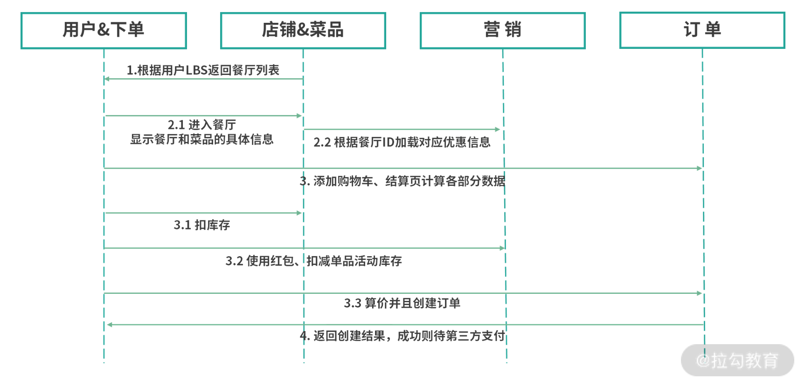
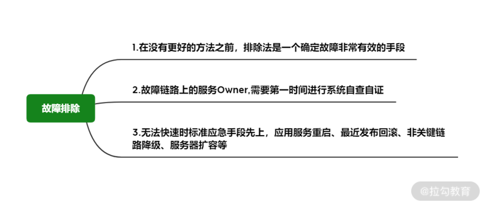
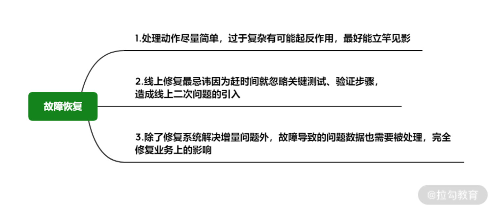
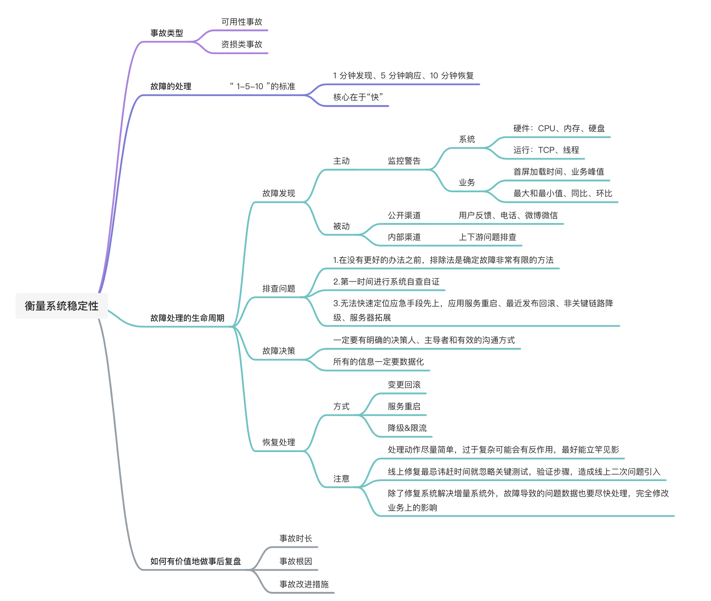
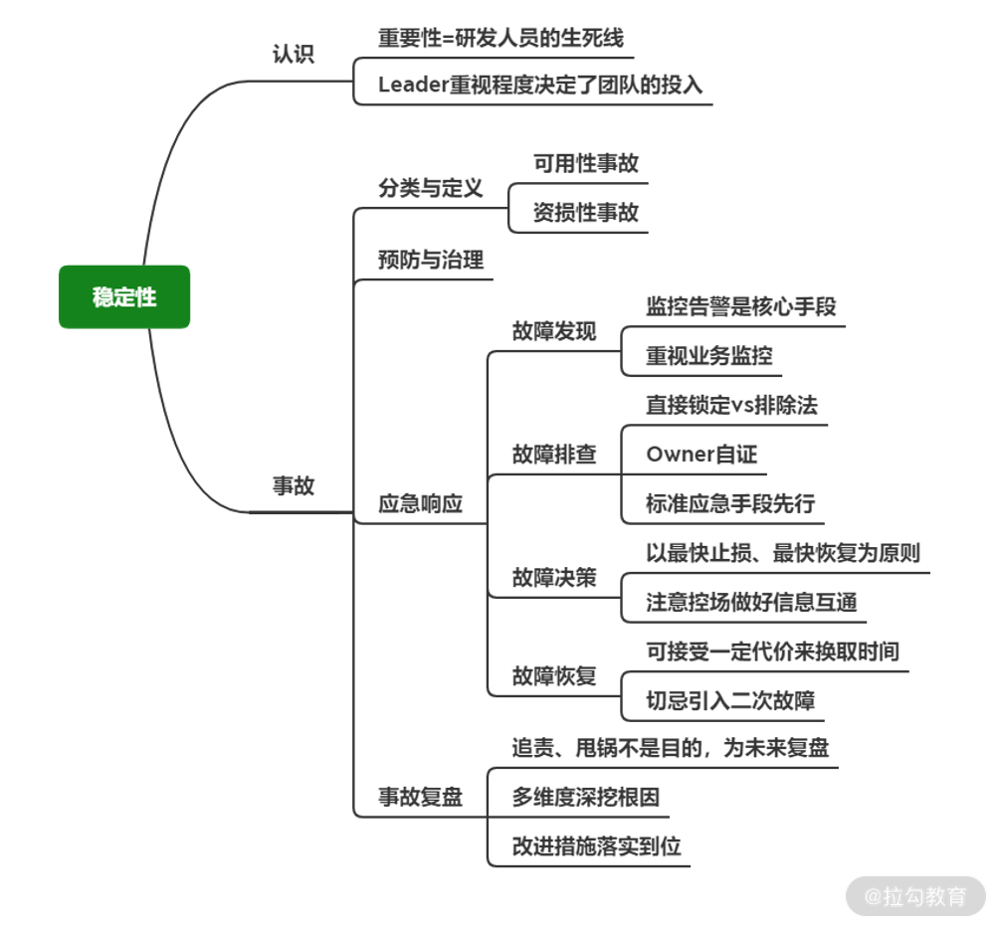

# 稳定性（一）如何应对事故并做好复盘

 ## 前言 

通过饿了么2018年9月15日发生的线上事故，简称915引出系统的稳定性

作为技术 leader，如何认识稳定性、如何应对故障、如何从过往的事故中汲取足够的经验，就成为一个团队能否做好稳定性的关键。

 ### 怎么衡量系统稳定性？ 

业内常说 4 个 9 的可用性，即1 年内 99.99% 的时间系统是可用的，不可用时长仅为 52.6 分钟

在阿里这类互联网大厂中，每年都会确定稳定性 KPI，以事故数的计量为准，对于事故发生的前、中、后分三个阶段来看对应的关键点

● 事故的类型：可用性事故、资损类事故。

● 事故前预防：主动治理减少系统的风险隐患，重点在变更管控、可用性设计、应急预案与演练。

● 事故中应急：“止血、恢复”是原则。

● 事故后复盘：目的不是追责，查根因、改进架构、完善应急、总结经验才是我们想要的。

 ### 你遇到的事故是什么类型？ 

● 可用性事故：技术原因导致系统部分或者全部功能不可用，业务没办法正常完成对应流程或者提供对应服务。

​	○ 比如因为网络、DB、接口 Bug 等原因，用户没办法登录、商品列表不显示等。

● 资损类事故： 系统的功能都能正常使用，但因为逻辑、计算等原因让业务的某一方产生了资金损失。

​	○ 比如用户支付一律为 0 元、错发 999 无门槛优惠券、商户清结算少打款给商户等等。

**●** 区别：

​	○ 可用性事故的根因大多在技术本身，

​	○ 特点是发现容易、杜绝难、业务影响明显、对应急处理速度要求高

​	○ 资损类事故更多和隐蔽的业务逻辑和架构设计的缺陷有关，

​	○ 特点是非常隐蔽、难发现、往往持续时间长、防控成本高、大部分开发同学意识薄弱。

### 故障发生时应该如何应急？ 

**作为团队Leader应该起到“定海神针”的作用，故障发生时控场就是你的核心职责。**

**如何做：**要有条不紊地安排同学进行排障、确定信息沟通的秩序、结合信息做好线上同步，并参与决策。

**标准：**在阿里执行的是“ 1-5-10 ”的标准，即 1 分钟发现、5 分钟响应、10 分钟恢复。

故障处理的生命周期，可以分为 4 个阶段：故障发现、排查问题、判断决策、恢复处理

外卖点餐的业务流程图

​	

 ### 1.故障发现 

需要对业务和系统有较长链路的理解和掌握，主动+被动

 ### 2.排查问题 

故障排查最直接有效的核心思路就是直接锁定 + 排除

 ### 3.故障决策 

能否第一时间止损很大程度上取决于技术 Leader 的现场反应和操作

两个关键点：

1. 一定要有明确的决策人、主导者和有效的沟通方式(钉钉群、多人电话会议、紧急作战会议室等），让信息可以通畅地交流出来，**并且决策人可以根据情况做判断与取舍，形成所有人明确的处理结论。**

2. 所有的信息一定要数据化，不同的数据量级会导致决策不同

### 4.恢复处理 

业务决策后就需要执行相应的技术操作，最好的情况当然是在系统设计时就准备了预案，那么此时可以安全且快速地执行，并且对不涉及业务决策的问题可以技术直接操作，节省时间

### 如何有价值地做事后复盘？ 

复盘的核心不是为了追责或者甩锅，而是最大程度榨干事故的剩余价值，通过全盘的思考与总结，来看看系统设计、流程机制、应急处理、人员安排等各方面有哪些不足，哪些可以提升的地方，哪些问题是共性的，需要在各团队进行“大扫除”。

深挖的点

1. 事故如何发生的

2. 如何处理的

3. 未来怎么预防

**要带领团队把精力放在改进措施的落实以及事故前的治理上更有价值**，要留出时间让团队伙伴进行内部的 Review，避免为了开会而复盘。

 总结 

对于稳定性在思想与实际情况下都要做好未雨绸缪，作者说的话稳定性是一个先有意识后有能力的事儿，毕竟你的态度和认识决定了团队的重视程度。

**业务快速发展的同时，技术必然存在妥协**，业务上需要快速的需求交付，技术上需要架构的可扩展，但速度和质量在工程领域总是存在冲突，而稳定性往往就是问题爆发的冲突点。作为技术 Leader，你要平衡好这两种诉求，让技术与业务协调发展的同时，最大程度确保系统的稳定运行，毕竟“没有质量的交付，再多再快都毫无意义”。

