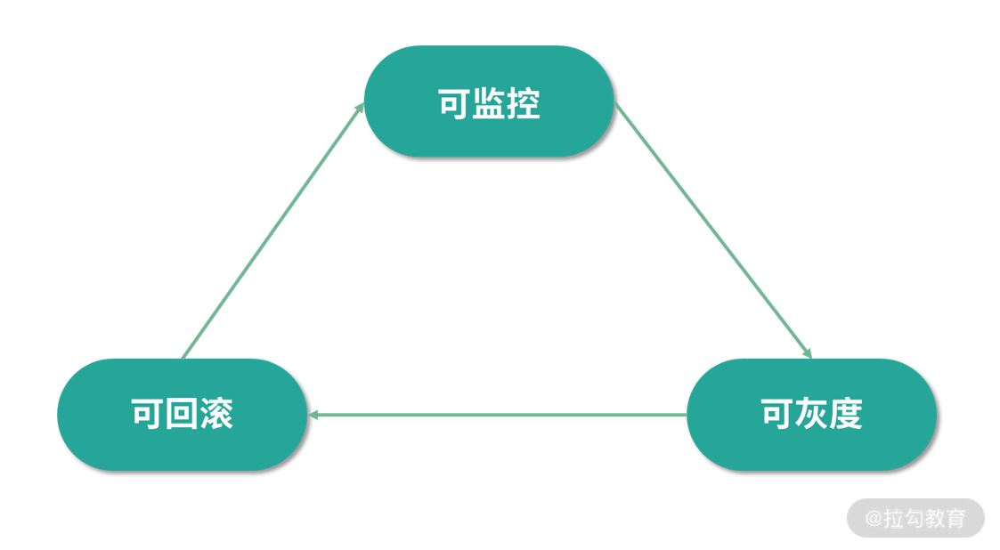
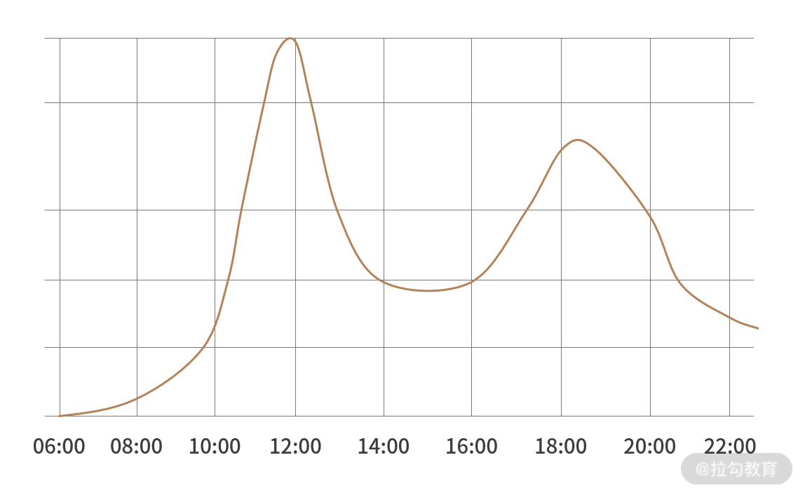
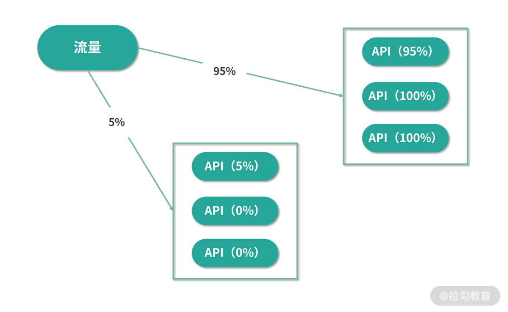
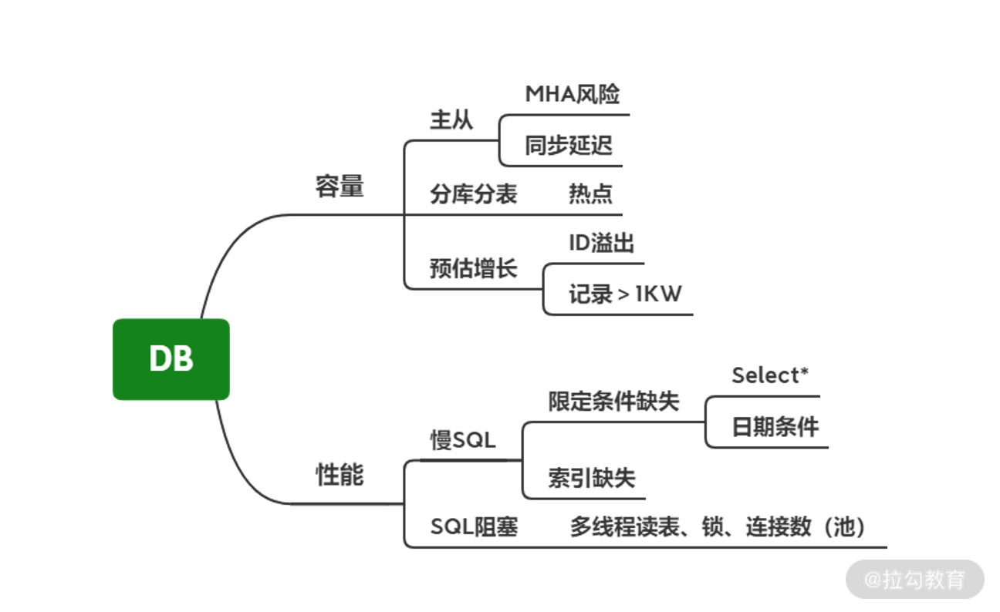
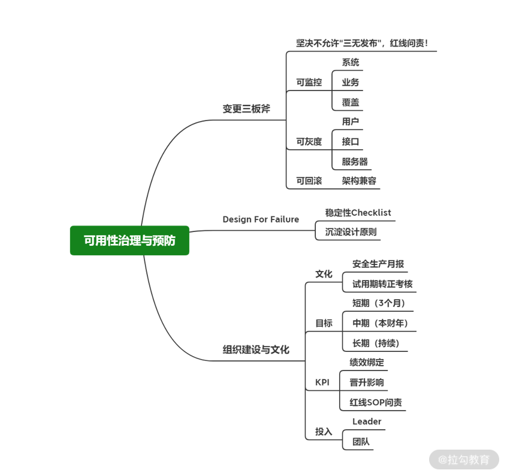

# 稳定性（二）可用性治理的三个关键要点

 ### 前言 

事故的“预防胜于治疗”

**如果把事故比作火灾，那么技术 Leader 日常工作的核心就是围绕系统的风险隐患，建立“防火墙”。**

从研发的流程阶段来看，确定产品需求后，会通过架构设计、编码、测试、上线几阶段来交付系统，上线环节是事故的高发阶段。

治理系统稳定性从三方面入手

1. 变更管控

2. 架构设计

3. 管理手段

 ### 变更会引起90%以上的故障 

为了应对变更时所带来的不确定性，我们在团队内部实施了严格的发布 SOP，简称为“发布三板斧”

 ### 1. 变更需要监控 

完善的监控告警比人工反馈响应更快，也会减少故障的持续时间进而降低影响。

在推进监控落地的过程中，你要和团队成员讲明监控的重要性，还要确保监控的完善与有效

有效的监控要回答三个问题

1. 是否有问题发生？

2. 哪里发生了问题？

3. 发生了什么问题？

这三者是递进关系，对监控的覆盖程度与范围要求越来越细致。

要结合业务场景去设计，才能够更加精细化地感知异常

例子：“KA商户接单曲线”的监控

通过外卖接单曲线图，来监控某品牌的系统今天是否出现了问题，

要结合业务配置有效的监控，而能否第一时间发现变更导致的异常、缩短异常带来的影响，就要看监控是否完善了。

 ### 2. 有效灰度必须有耐心 

 💡 Tips：灰度发布（又名金丝雀发布）是指在黑与白之间，能够平滑过渡的一种发布方式。
  可以进行A/B testing，即让一部分用户继续用产品特性A，一部分用户开始用产品特性		             B，如果用户对B没有什么反对意见，那么逐步扩大范围，把所有用户都迁移到B 上面来。灰度             发布可以保证整体系统的稳定，在初始灰度的时候就可以发现、调整问题，以保证其影响度。

 💡 Tips：灰度测试，就是在某项产品或应用正式发布前，选择特定人群试用，
  逐步扩大其试用者数量，以便及时发现和纠正其中的问题

**灰度从来不是为了测试，也不等于 A/B Test。它本身是为了对抗“未知的不确定性”。**

要想实现灰度的有效性，关键点在于时间和流量

1. 时间：每个灰度阶段至少有 5 ~ 10 min 的观察，在监控、日志和各方反馈没有异常后再扩大灰度范围，确保一些运行时异常或量变积累质变的问题可以暴露出来

2. 流量：有时一些业务场景需要特定的触发条件，比如满足某些条件的用户或满足某些条件的订单，那么在灰度时就不能仅通过单位时间内有没有异常来判断，还要确保有足够的有效流量。

   

建议结合实际的系统情况与风险程度来确定灰度的程度，平衡好时间与效率，这些投入的时间无论怎样都会大大少于你在事故复盘会上后悔的时间

 ### 3. 回滚就是变更的“后悔药” 

新版本发布后如果线上环境出现问题就应该立刻回滚，以下情况除外

1. 影响面非常小（风险在可控的范围内）

2. 涉及到重要商业合作（不可抗拒因素）

回滚的代价降低到最小

● 遵循“只增不改”原则，比如将原有API接口拷贝一份，在新的API中修改，一旦新的API有异常，可以直接回滚到旧的API即可

● 这就是确保变更可回滚

 ### 小总结 

● 无论是灰度测试还是回滚都应该在架构设计之初就应该考虑进去，这是保证程序稳定性的前提

● 在后续综合排期、风险程度、成本投入要做好评估和平衡

 ### 坚守 Design For Failure 的架构理念 

Design For Failure => 失败设计 => AWS 的一条最佳实践

Design for failure and nothing will fail => 为失败而设计，没有什么会失败（面向失败进行系统设计）

将经验教训沉淀记录下来为后续实际工作中落地

个人理解：

1. 先对发生过的线上事故做出总结沉淀

2. 逐步建立一套线上事故预案（预案培训）

3. 根据预案定期对全体成员先进行演练

4. 最后在不知情的情况下，注入不确定的故障，检验团队是否可以及时感知和做相应的应急处理

 ### 把稳定性当作机制与文化去建设 

● 作为团队Leader自己就要重视稳定性，通过自己作为团队标杆，团队的成员才会引起重视

● 入职新人Landing要从稳定性开始学习，1-2周时间除了熟悉基本环境，还要通过发版的考试，利用心理学“承诺一致性原则”要求新人向团队所有成员发送稳定性学习成果，产生敬畏之心，同时作为3个月后转正的考察项之一

● 稳定性作为KPI的重要考核项，涉及自身的奖金和晋升，每个人都会引起重视

● 根据稳定性每个月评比一次红黑版成员，使组员可以看到该学习什么，规避什么，达到共同看见，共同学习的目的（奖惩不是目的只是手段，真正的目的是让团队成员能重视稳定性，达成意识）

 ### 总结 

想要系统稳定，首先要做好预防

1. 变更发版后所产生的一系列问题，该如何应对

​		a. 监控

​		b. 灰度

​		c. 回滚

2. Design For Failure 

​		a. 总结-checklist

​		b. 预案-沉淀设计原则

​		c. 演练-检验效果

3. 稳定性文化

​		a. 重视

​		b. 新人

​		c. KPI

​		d. 红黑版

