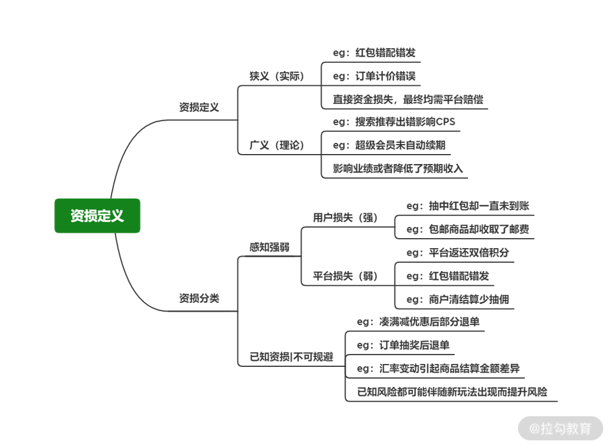
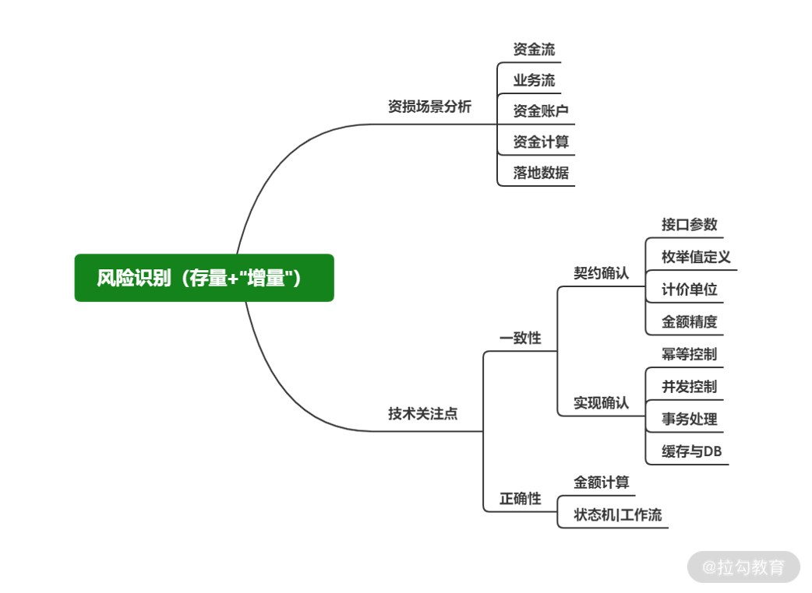
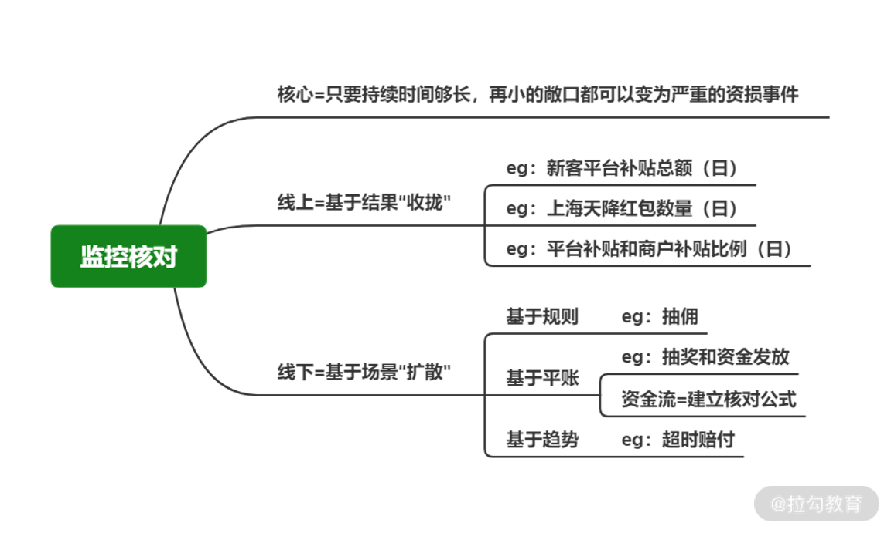
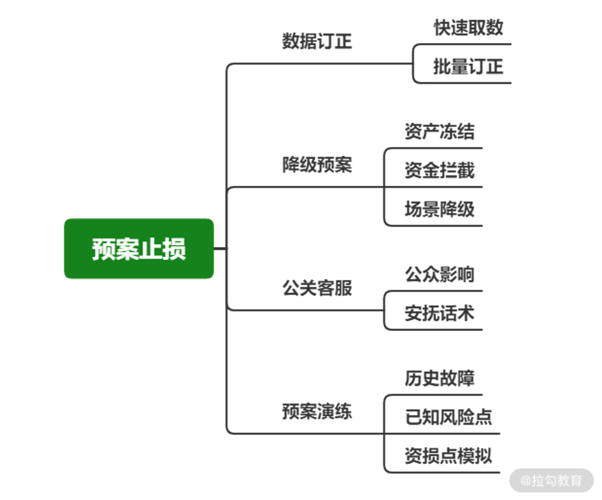
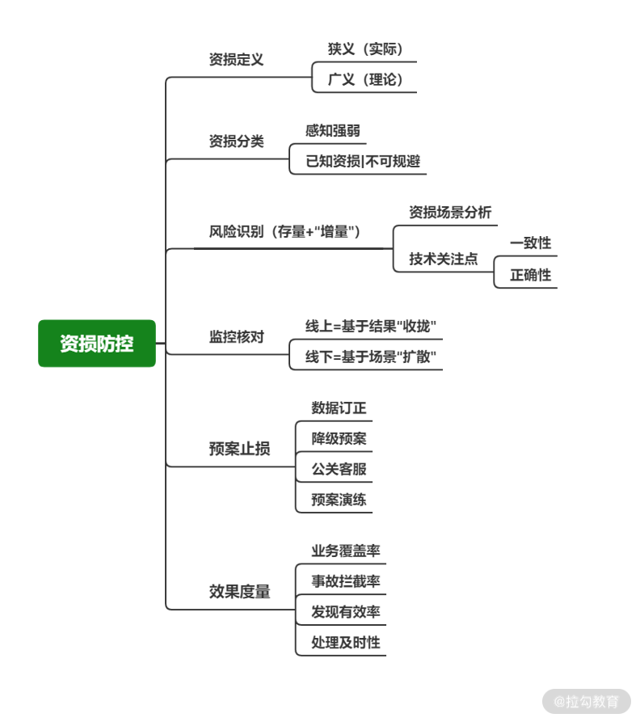

# 稳定性（三）：那些年源源不断的“红包”事故

 ### 简介 

资损类事件

​	● 京东无门槛领取200元小家电红包

​	● 商户配错价格

​	● 秒杀商品大量超卖

以上资损类事件的几个特性

​	● 感知难

​	● 修复慢

​	● 影响大

从两个角度思考

​	● 如何理解资损事故

​	● 如何预防、应对资损事故

 ### 建立资损概念的宏观认知 

错误认知：**狭义上只关注真实流失的资金**

广义上只要理论上存在资金流失就是资损，举例如下

1. 广告的收入减少

2. 因系统BUG，导致用户取消的订单申请被默认同意

资损举例如下

 ### 资损防控的三个关键 

要把精力投入到预防上，引出防控三个关键字

1. 防

2. 监

3. 控

 ### 防：资金视角做风险点识别 

 ### 监：一致性与正确性双核对 

线上业务结果收拢监控，线下场景业务扩散核对

构建核对公式进行对比

​	● 积分发放： 积分系统发放 100 积分给用户 A = A 用户账户中新增 100 积分

​	● 库存扣减： 订单系统生成包含 2 件 A 商品的订单 = 商品系统中 A 商品库存减 2

​	● 下单返红包： 用户支付金额 * 返还比例 = 用户账户新增红包金额

 ### 	控：资金拦截 + 资产控制 

如何资损止损事故

1. 问题止血不新增：关闭问题源头，采用降级处理，比如对于涉及到资损的功能下线

2. 控制资金流出：对资金和资产进行拦截与冻结，避免外流后损失无法修正，比如禁止用户勾选有问题的红包

3. 存量数据订正：对问题数据快速批量处理，比如批量修改红包金额，将红包设置为失效

 ### 总结 

1. 资损的概念：已经造成资金损失，或者是有资金损失的风险

2. 资损防控的关键点：

​		a. 防止：

​			■ 业务逻辑

​			■ 资金变化

​		b. 监控

​			■ 线上收拢

​			■ 线下核对

​		c. 控制

​			■ 代码降级

​			■ 冻结资金

​			■ 数据修正

3. 作为技术Leader

​	● 应该加深对资损概念的理解，并引导团队加强这方面的认识；

​	● 围绕你负责的业务，构建风险梳理的“套路”，排查隐患；

​	● 重点围绕业务场景打造高覆盖度的监控核对，早发现、早治疗、少损失；

​	● 尊重墨菲定律，围绕可能发生的问题做好预案和演练。

​	● 看到别人看不到的，想到别人没想到的，引领团队往正确的方向走

