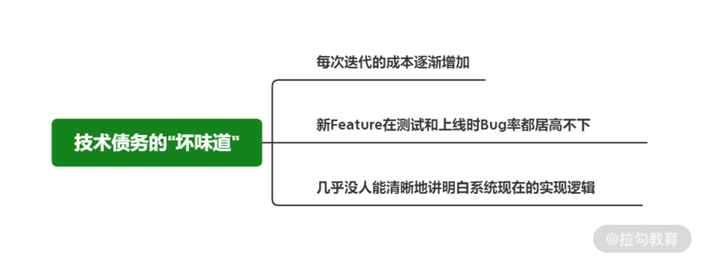
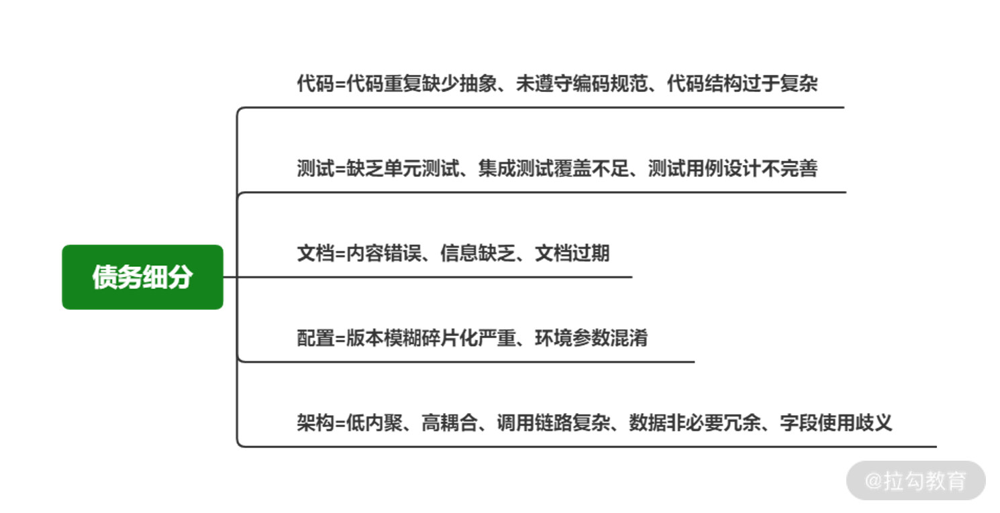
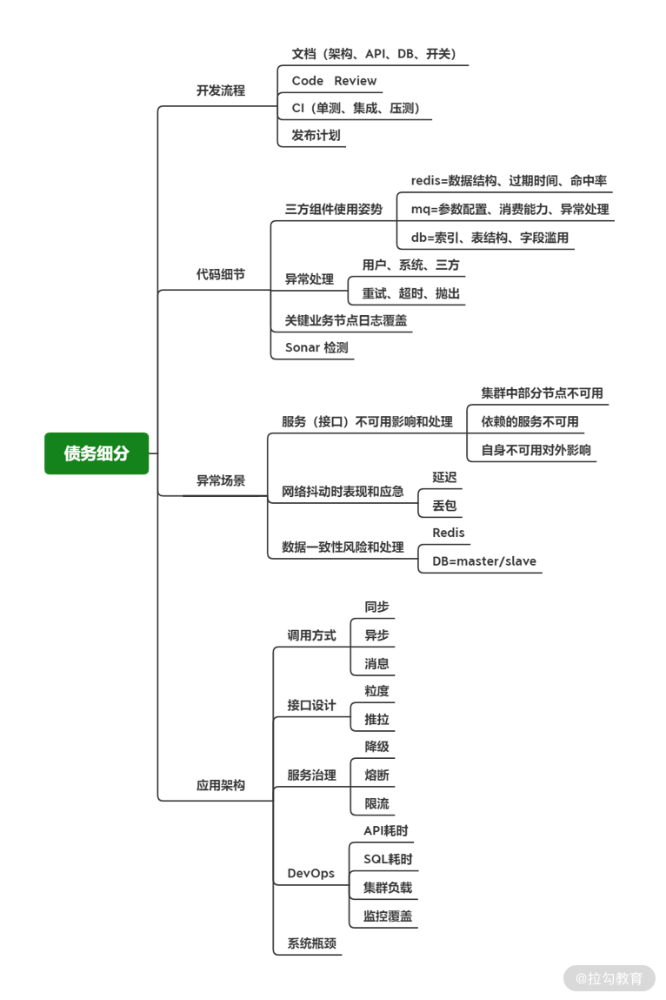
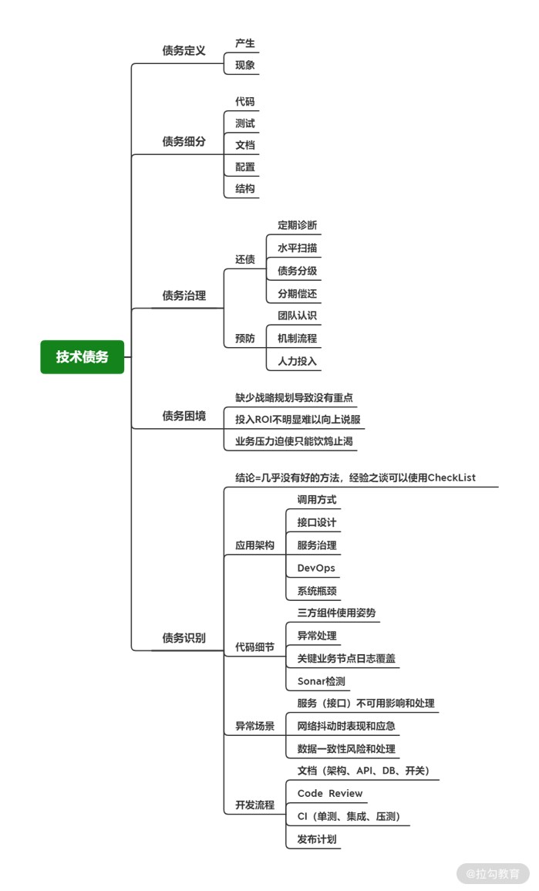

# 技术债务：如何带领团队从困境中突围而出？

 ### 简介 

除了做好团队管理外，还要解决技术与业务发展的矛盾产物-技术债务

 ### 我对技术债务的理解 

  💡 Tips：技术债务：设计和实现没有遵循最佳实践，就埋下了稳定性的风险隐患，大白话就是由于发展的需要，没有按照代码风格、标准、和最佳的实践，从而对系统产生迭代成本高、Bug率高、代码逻辑不清晰等后果

 ### 技术债务的产生 

1. 能力不足根本没有意识到债务的产生与积累

​		○ 开发者编写了低质量或者有潜在风险的代码；对系统的实现和运行不了解，重复代码被大量构造，缺少抽象与沉淀；缺少完善的开发机制和流程把控，比如测试、文档等方面做得不到位

2. 因交付压力进而在技术方案与实现上妥协形成已知的技术债务

​		○ 项目很复杂或排期压力，不得不在系统的架构设计与代码实现上作出妥协，选择最容易的方式而非最好的方式

​		○ 甚至会跳过方案的详细设计，直接开始 Coding，不深究代码风格、标准、最佳实践，更进一步则会压缩测试方面的时间与投入，只为了尽早上线

 ### 技术债务的体现 

 ### 为什么你要重视技术债务？ 

1. 影响系统扩展和需求交付

​		a. 系统可扩展性

​		b. 问题的改造和修复成本高

​		c. 迭代困难

​		d. 导致系统无法按期交付

2. 恶性循环导致人员流失

​		a. 迭代困难

​		b. 交付压力增大

​		c. 再次做技术妥协

​		d. 最终以实现业务优先

**技术债务的恶性循环会影响开发团队的生产力，并降低团队的士气和成员的驱动力**

 ### 如何从循环的债务困境中突围而出？ 

 ### 1.债务的 Owner 是技术 Leader 

**要想解决清楚一个问题，就必须先定义清楚这个问题：**

关系链：交付压力 => 技术妥协 => Leader

1. 交付压力导致的技术债务和自己无关

2. 任何一家成长中的公司，都会存在技术资源与业务发展的矛盾

​	● 矛盾消失 => 说明公司业务增长放缓 => 陷入瓶颈 => 技术资源过剩要裁人

3. 我们追求的是技术与业务之间的 Balance，将它们控制在一个动态适配的状态

4. 当“交付压力产生技术债务”变成一个普遍的现象

5. 我们应该认识到这就是发展中的一部分，**而解决这类问题，是你的责任和本职工作之一**

**换一个角度来说，你是整个团队中最理解技术债务影响、最懂系统架构与迭代能力的人，你不解决这类“技术问题”，难道要靠产品、销售、运营或者管理层来解决吗？**

**所以我非常不建议你一谈到技术债务，就下意识地路由到“交付压力太大、排期太紧、产品设计太复杂”等理由上，这样的“甩锅”只会将你从解决问题的决策者变为服从安排的执行者，不但对解决问题没有任何帮助，还从另一个方面证明了自己失职。**

（复制这两段话是觉得作者总结的很精辟，自己远没有达到这个层次，学习的路还很长面试中如果问到类似问题也可以借鉴作者所说的，看多了，经历过了自己也就会了。）

#### 如何解决技术债务 

内外双修

​	● 对内：加强团队战斗力，减少债务机会，增加债务处理能力

​	● 对外：深刻地理解业务，并且做好与其他协作方（尤其是产品、业务）的沟通，出谋划策作为既懂技术又懂业务的你找到最优解的方案

面对选择题时不要只看到可选项，要永远寻找第三条路。 如果实在没有其他选择，在技术妥协的同时，做好沟通，让协作方明白方案的临时性以及对未来的影响，争取到承诺在未来给你足够的空间解决这些问题。

### 2. 通过 CheckList 识别债务 

记录债务所产生的隐患，以后想办法把坑填上

结合我们之前踩过的坑、发生过的问题，以及编码、架构制定出一个较为详细的 CheckList如下图	

### 3. 有计划地分级偿债 

债务按优先级排序

1. 关键链路优先

2. 历史事故命中优先

3. 可扩展性优先

4. 权责清晰优先

通过对技术债务进行分级，实质上也是一个问题分治的过程，将大问题切分成一个个小问题，这样就可以将它们加入日常的迭代中，形成一个分期偿还技术债务的计划，逐步减少技术债务，减轻负担让团队与系统可以轻装上阵

### 4. 正视债务做好预防 

● **提升团队认识**，通过项目复盘、系统重构、事故 Review 等各种机会，通过实际的案例让研发同学清楚技术债务对团队产生的负担，以及对个人能力提升的影响。

● **建立机制流程**，比如在方案设计阶段向下深挖一下实现的要点，更多资深的开发参与到架构评审，或者促进团队形成 code review 的习惯并且达成一个共识标准以提升系统质量。

● **确保资源投入**，在通过债务识别和分级后，将还债的投入提前计算到每次迭代中，确保有一定的资源投入其中。

### 5. 一些常见的误区 

通过 CheckList 做债务识别，然后定期诊断、水平扫描、债务定级、分期偿还来做技术债务的处理，最终在团队认识、机制氛围、资源保障上下功夫做预防，这就是技术债务管理的核心思路。

● **存在即合理，动态变化才是王道**：接受技术债务一定会存在的事实

● **不积跬步无以至千里**：重视日常的小问题，才会远离重大的影响

● **机制流程外还要讲策略和方法**：机制流程并非越多越好，要精而细致，奖惩兼有，不能只追杀要结果，下属有疑惑要给帮助、给方法、给支持

### 总结 

与金融的债务有类似之处，核心是取决债务分期的手段，何时分期(解决遗留问题的时间段)？一次分多少(按什么顺序去解决)？非常考验你的能力

研发人员经历的最多就是技术债务~

