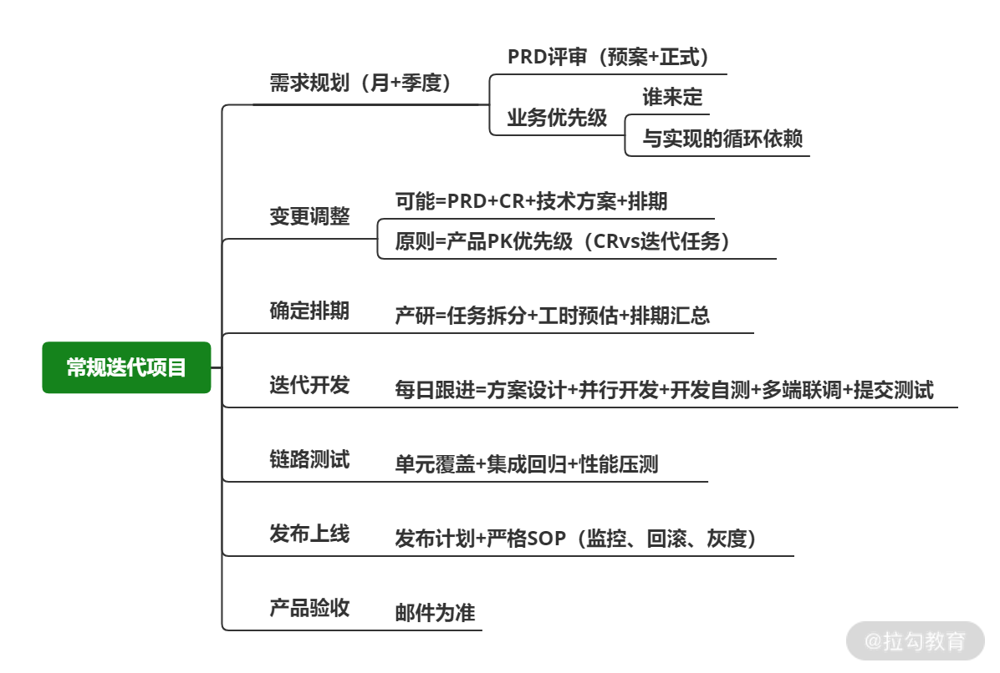
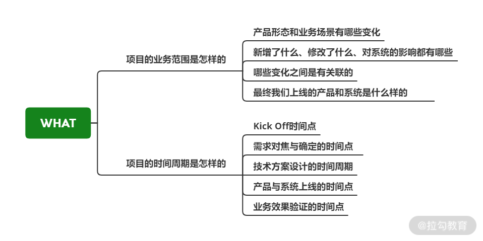
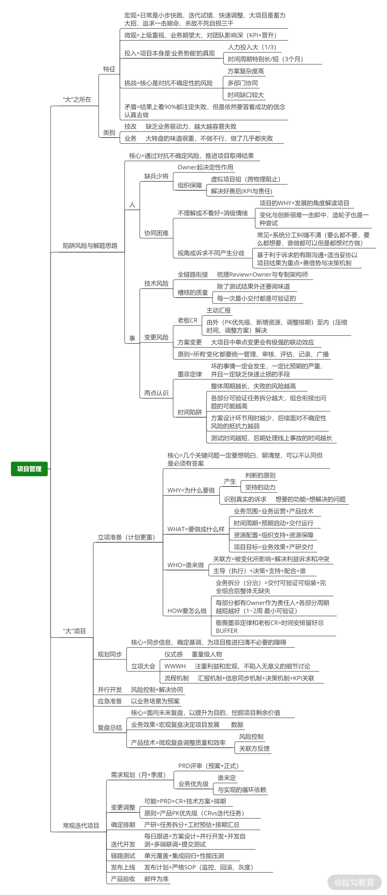

# 大项目：把握关键点，谋定而后动

 ### 前言 

团队开发有两种模式

​	● 项目制

​	● 敏捷迭代

**何为大项目？**

​	● 老板项目

​	● 核心系统重写

​	● 倒排期的重大项目（618，双11大促，新产品研发）

 ### 认清异同，做到心中有数 

常规项目流程

**在这个常规流程中，技术团队的重心是把执行做到位，你要更关注过程管控，确保系统交付。**

大项目差异

​	●  出发点不同，业务期望更大

​	●  规模不同，复杂度更高

​	●  结果评判标准不同，影响更大

 ### 把握关键点，谋定而后动 

项目失败的原因

​	●  没有制定完备的计划

​	●  目标都没有共识，何谈执行到位

**越是重大的项目，在计划、设计、准备上投入的精力就应该越多，谋定而后动**

 ### 围绕的几个项目重点

 **WHY（项目为什么做）** 

WHY 是在确定项目的动机和目标，不搞懂项目为什么做，当你要解决困难时，就会缺少核心的逻辑依据

 **WHAT（项目做成什么样） **

 **WHO（哪些人来一起做项目） **

你需要确定项目的核心人员并罗列项目所有的关联方

 **HOW（启动项目后如何做） **

​		●  合理拆分任务（模块）：以终为始，从最终要的结果来确定如何开始拆分

​		●  保持风险意识，敬畏墨菲定律：大项目在推进过程中极易发生突发情况和概率性事件，要做好预案，比如项目排期上一定要预留足够的 Buffer，提前确定好紧急处理问题的机制等。

 ### 如何处理棘手问题 

 **问题一：缺兵少将怎么办？ **

1. 从其他团队借人（不建议）

​		a. 会产生问题：其他团队的同学不熟悉业务和系统，

​		b. 你们之间没有汇报关系，作安排和任务执行上并不通畅

2. 同一个项目组的跨组织结构成为常态与共识，设计灵活的绩效、考核、汇报体系，让每个人都可以按需灵活地加入项目组（建议）

​		a. 从更大的范围内寻找合适的同学，而不是看你团队有哪些人

​		b. 将参与项目的同学在一定时间内的汇报关系和绩效考核汇总到项目组中，由项目负责人根据实际情况重新安排每个人的权责，并确定绩效的绑定关系与比例。

​		c. 项目交付并不等于结束，所有人的绩效结果都应和项目目标的达成情况紧密且长期关联。

3. 选择合适的人做项目Owner，项目 Owner 几乎决定了项目成败的 80%，如果 Owner 能力不足，你要给予帮助和支持，或者另找他人，乃至上级的帮助，不要在 Owner 的人选上妥协，毕竟项目成败才是关键。

**问题二：推不动的到底是人还是事？ **

**事情推不动的背后跟人和组织有很大关系，**处理不当会加剧不同关联方的冲突

1. **搞明白冲突现象下的利益诉求**： 不同关联方产生观点冲突的现象背后其实是利益冲突，你要搞清楚彼此的顾虑。比如我不愿想让某个系统字段落到订单中，主要是考虑到订单系统的可维护以及稳定性，如果你能解决我的顾虑，会容易说服我。

2. **为项目结果适当妥协**： 在很多情况下，我们无法做出完美的方案，可能就是要在系统内通过很糟糕的实现去实现需求。项目没有 100% 完美，抓住核心原则不放弃，可控部分适当妥协换取项目前进是很好的策略。

3. **通过项目地位和决策机制推动项目**：大项目往往是公司重大战略下的产物，一般情况下，不会有人去反对公司的某项既定战略，而你可以通过大项目的重要性在体系内争取更多的资源和帮助。如果你面临一些冲突，要学会利用决策机制，通过更高级别成员的沟通决策拿到解决方案。

**问题三：一定会有项目变更吗？ **

两种项目变更

1. 项目演进过程中识别出之前未能识别或考虑缺失的点，导致方案需要调整。

2. 出自老板的需求变更，很多情况下都是要新增内容。

给你的建议是保持平常心，做好两点

1. 由外至内解决，先从优先级调整、新增资源、调整排期入手，不行就考虑压缩时间、调整方案乃至加班。做好 ROI 和风险的权衡，不要为了解决 A 问题制造更难解决的 B 问题。

2. 统一变更管理，所有的变更都应该统一管理、审核、评估、记录最后广播给项目全员，确保大家信息一致，对终点的认识没有误差。

3. 补充：如果你被老板频繁的变更所困扰，试着多做汇报，让他对项目的进展与正在解决的困难有更直观的感受，这样他对新变化带来的不确定性风险会有更强的同理心。

### 总结 

经历大项目的洗礼应对管理类的事物会显得更加的成熟和稳重

大项目是技术 Leader 的试炼场，不仅考验你的技术能力，还会从产品、业务、沟通、事务推进等多方面考验其综合能力。而经历过大项目毒打的同学在处理别的问题时，会更加从容。

三个重点

1. 驾驭大项目是你的试金石和分水岭，对自己职业规划有一定要求的同学一定不要放过打磨修炼的机会

2. 在大项目中，往往人的问题会比技术与系统的问题难解决，因为与人相关的问题未必完全理性和逻辑，那么此时你也不妨看看感性的沟通与交流是不是有更好的效果

3. 时刻牢记你将项目按时上线没有故障只是做到了60分，更关键的是业务效果，所以除了盯紧开发过程外，还要在最开始的业务与产品设计阶段就投身其中。

