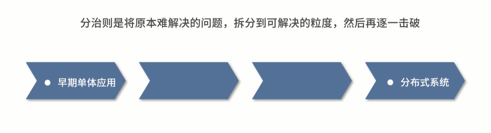
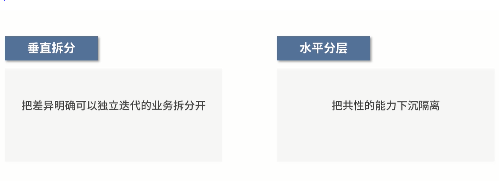

# 架构设计：业务理解、治理系统复杂度

## 一、业务理解：深入业务是做好架构的前提

### 简介

 

架构设计与系统演进是技术 Leader 在技术工作上一定要做好并且极为重要的

架构要结合具体的业务场景来设计，**要深度理解业务**

 

### 为什么技术要理解业务？ 

#### 产品需求不等于业务诉求

 

*   如果你不关心需求的源头，不去理解业务，只是低头实现，长此下去，真实的情况会更可怕（个人觉得只取决于做产品的公司，如果是项目制的公司，甲方提出需求，一般情况下乙方是没有什么发言权的只能去实现，有些理想化）
*   首先，要搞懂为什么要实现这个需求，否真正解决业务问题

#### 为什么技术团队会被定义为支撑实现的团队

1. 用户的真实需求在到达技术之前会经过业务、运营、产品等多个环节，每一层都会被加工、处理、拆分，技术看到的问题可能距想解决的问题已经很远了，

​	● 核心：没有搞清楚问题的源头

2. 技术 Leader 在会上如果仅仅是听“自己团队应该做什么”，

​	● 核心：而没有思考和探究业务的根本诉求

### 领域建模的前提是理解业务

 

> 💡 DDD（领域驱动架构设计）通过一套统一的标准描述业务流程与组成

缺失的

并不仔细看业务的现状、推测业务的发展，我们认识的只是一个个需求，而非整体的从业务维度思考系统的设计，导致系统复杂度越来越高

解决

深度理解业务就是前提，你对业务的理解程度影响了你对系统未来发展的预判程度。

### 提升技术团队的使命感

技术同学对业务的直观感受大多来自线上的产品和系统，这和直接接触用户有很大差别，这和直接接触用户有很大差别

例子：

作者之前负责的技术团队会定期安排同学在客服中心听线，然后与一线的客服人员直接沟通痛点，往往技术同学会受到来自用户和客服的双向暴击。比如营销系统研发的同学，可能一边用户会责问为什么某个红包无法使用、为什么系统优惠计算的金额和自己算的不一样，另外一边客服同学也在抱怨优惠信息查询复杂、不同红包的互斥规则在系统中没有体现等。技术同学一边收集问题，一边真实地与这个世界交互，而不是写完一段代码提交发布就结束了。

身临其境对真实世界产生影响进而生成的同理心是非常关键的

**你写的每一行代码，线上的每一次发布，都会改变用户的体验，解决实际的问题，你就会发现这份工作的意义**

### 如何理解业务？

 

Leader 候选人怎样能崭露头角

1. 技术功底扎实

2. 对业务的熟悉深入理解

3. 在阿里，P7 以上的技术人员能否晋升，深度理解业务很重要。而且级别越高，对你理解业务的程度要求也越高

对了解、熟悉和深刻理解不能混为一谈，此外还有深度与广度之分

近观乃至下场去看、去做、去思考和尝试才能说是真正理解（要实际去体会）

### 不要盲信产品 

 

在讨论 PRD 和执行开发任务之前需要做的

​	● 学会独立思考

​	● 深入理解业务想要解决什么问题

​	● 需要什么效果或作用

​	● 严格把控那些伪需求和无价值需求，防止它们侵占团队的技术资源

### 建立走进业务的机制 

 

*  代入用户视角，去实际地体验一下

* 滴滴打车发给员工一些消费券，打车过后将体验的感受好的糟糕的总结过后，并反馈到有关部门

* 饿了么定期到某个城市去和市场 BD 的同学一起走访商户，作为骑手去餐厅取餐送餐，以此体验业务上的细节

  技术团队也要建立走进业务的机制（业务同理心）

* 实际去体验业务会让你建立很强的认识感与同理心（要带着发现问题、解决问题的想法）

* 不要让业务机制成为“一次性作秀”，最好有一个低成本可持续的机制

* 站在用户的角度才发现一些痛点问题

* 思考技术是不是能解决这些你原本未必知道或关注的问题

建议从客服入手，成本低、效果好、每次都带着任务来也带着问题走，很容易就形成一个可持续的循环。

### 业务上多参会多画图 

 

如何画业务流程图（UML类图）

只要能将“谁在、在什么时候、做什么、产生什么变化”这些画明白就可以了

饿了么点餐的交易流程图，可以简单画为

团队共同成长

* 将自己的理解分享给团队的其他成员，最好的改变肯定是从个体到集体

*  建立正确的认知，让整个团队认识、熟悉和理解业务

*  让成员明白理解业务与编码交付同样重要，有意识地去关注业务的变化、去了解业务的现状

*  每个人都对某一部分业务了解很深，可以通过各自分享的方式组合成一个完整的业务认识

* 重要的是形成这种认识和氛围 

### 总结

**感叹**

要意识到理解业务对实际工作会有巨大的帮助，在没看这篇文章之前对业务就是停留在了解就好的层面，没想到业务居然可以提高技术的上限。

**方法**

你要先在心里意识到理解业务的重要性和收益，然后愿意像研究代码一样去琢磨业务是如何运作、接下来可能会怎样发展，并且将这些思考和对业务重要性的认识反复传达给团队。

**既懂技术，又懂业务**

技术人深刻地理解业务所产生的结果是“1 + 1 > 2”的，很多时候业务乃至产品认为只能通过A方案来解决的问题，可能在你眼里还有B、C、D的方案，或者更清楚不同方案的利弊与取舍，因为懂技术可以带来无限的可能。

# 二、治理好系统复杂度才最务实

 

### 简介

架构的工作重点

*  系统复杂度的治理

* 治理之后：足够清晰、健壮、可支撑业务发展的系统才可谈架构演进

共识标准其他角色（架构师和运维专家）会帮忙补位

*  功能实现

*  性能优化

*  稳定性

 

### 治理好系统复杂度才最务实 

> 💡 Tips：C.A.R. Hoare曾说过：“软件设计有两种风格，一种是将软件设计得很复杂，以使其缺陷没那么明显；一种是把软件设计得很简单，以使其没有明显的缺陷”。

从接手历史系统解决性能文卡你会发现这些问题是之前一些**设计**和**迭代**时导致的，源于在**系统的结构性设计**上就没有做好。

技术价值在商业环境（业务方）中最核心的体现就是**让系统实现“可持续的快速交付”**

复杂度的治理：**系统的结构清晰、即使整体繁杂但是每个局部都相对简单、链路干脆直接，没有不必要的冗余**

 

### 衡量复杂度 

结合以下4点：

* 理解成本高：需要很长时间才能理解系统模块的组成及运作

* 变更牵连多：实现一个小的需求都要改造系统的多个部分，结果导致迭代成本高，并可能引入更高的风险

* 一张图装不下：牵连的系统、服务、组件过多或者链路设计不合理导致的。

* 加人无法解决问题：复杂度过高并且系统结构模糊，很难通过清晰的分工让生产力最大化。

带的问题：迭代压力大、经常延期、稳定性问题频发

解决方式：着手治理复杂度（不重做系统）

### 复杂度治理的思路

高内聚、低耦合架构理念，遵照这一原则，对系统做简化和分治

两步走

* 简化

* 分治

简化例子：

如下图A可直接调用B，大但是A调用了C再调用B就产生了不必要的冗余

分治：拆分，逐一击破，没有什么问题是拆模块解决不了的，如果有就继续拆

常见的拆分方式

1. 垂直拆分

​	a. 购物车和订单可以分成两个服务（流程上前后关联，各自具备独立完整的业务场景和生命周期）

​	b. 库存和商品则是强依赖的关系，库存无法独立于商品存储

2. 水平分层

### 复杂度治理实践

 

视代码的实现和每一次需求的迭代，**千里之堤溃于蚁穴**

实践

* 相比 coding 更重视设计：用更多时间思考如何设计并实现某一个功能，**写代码之前要先用笔和纸把编码思路写下来，捋清楚了再干**

* 永远做 2 套以上的方案：多几套方案不光能促使你多思考利与弊，也能让你对未来多一些考量

* 从 MVP （最小完整业务的角度）的视角考虑设计：先做减法再做加法

* 关注上下游的实现：站得高才能看得远，重视系统之间的相互作用

* 坚持“日拱一卒”：尽可能在每次迭代中修复之前的问题，逐渐完善系统的实现

目的：让系统更简单、更轻便，可以更灵活地跟上业务的变化

### 没必要一定把系统做成中台

**没必要一定把系统做成中台，不做中台就会落后更是无稽之谈，不过，你可以借鉴中台的思路作为系统设计与演进上的形态参考**

适合永远比最好要重要

而你的系统是否适合往中台的结构上演化，可以从下面三个方面，结合你的实际情况去考虑。

#### 是否有土壤基础 

如果你的公司（大部门）没有中台的战略方向或者对应的组织落地动作，那么单纯的技术中台是非常难落地的

#### 清楚中台并不完美

中台在落地过程中存在很多困难，3 个深刻感受

 

##### 1. 中台离业务较远

中台的抽象会有一定的滞后性，对业务快速迭代和开发起到的作用有限

如果考虑的是能力复用的需求，那么中台更适合沉淀已有的能力，对于全新业务如果和之前沉淀的业务关联不大，中台支持并不好

##### 2.中台资源有限 

 

本来的开发成本转移到中台一部分，但协作成本上升得更多，整体的效果与周期并没有很理想

##### 3.中台的灵活度有限

 

中台本身对业务的抽象和开放定制是有限的

##### 4.演进思路可以先行

 

中台体现了很强的技术属性（抽象、沉淀、复用、打通）

如果你追求的是一个足够灵活的系统，叫不叫中台又有什么关系？

### 总结

 

复杂度虽然不会立刻让系统崩溃，但是会逐渐腐蚀系统，更像是慢性病，需要长期的治疗（开发和架构习惯）才能克服

对很多同学而言属于未知问题，你都没有察觉到它的严重性和影响又谈何解决呢

建议你在系统设计时多从人和系统两个方面去考虑复杂度的变化，尽量让现在做的事对未来有帮助

