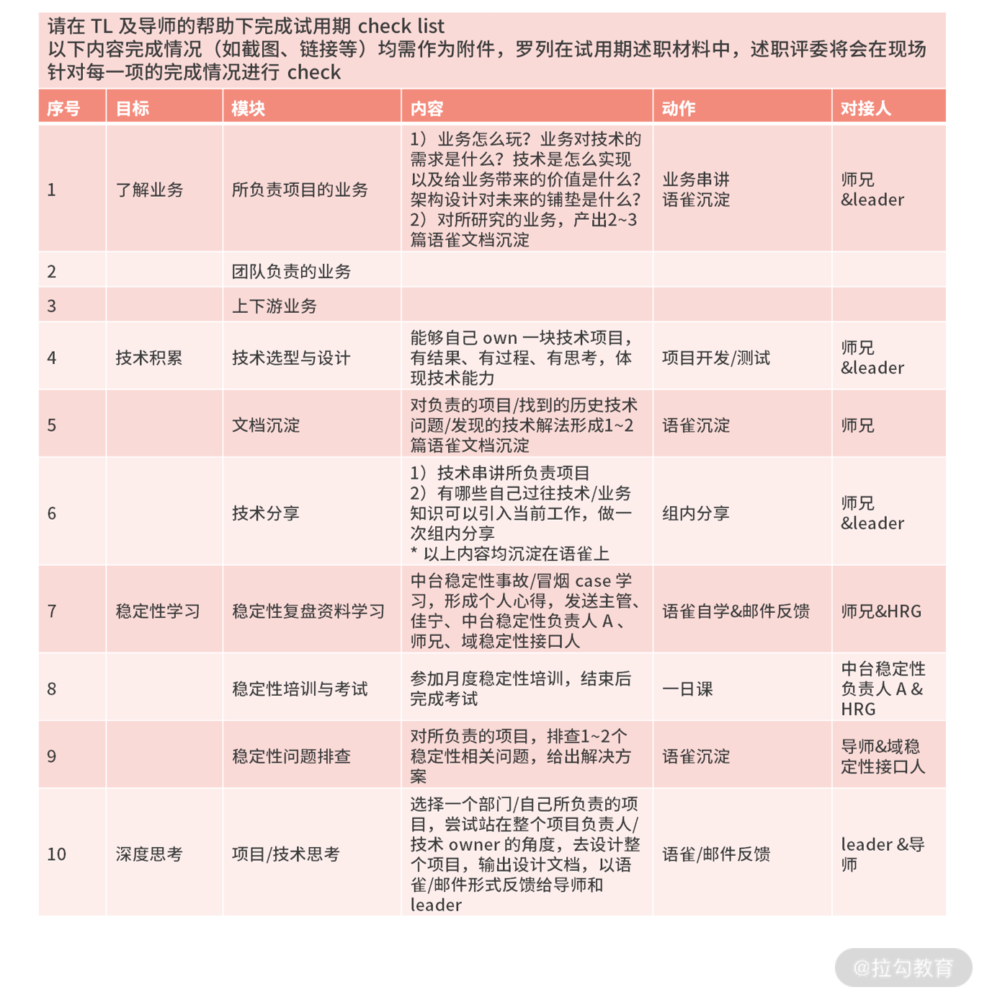
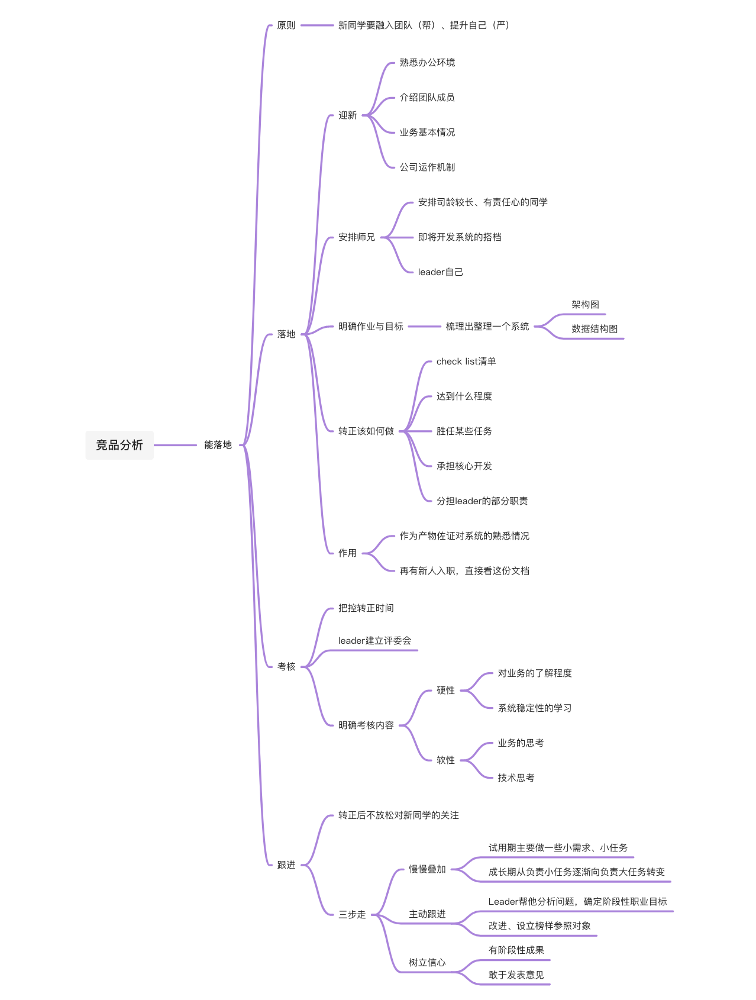
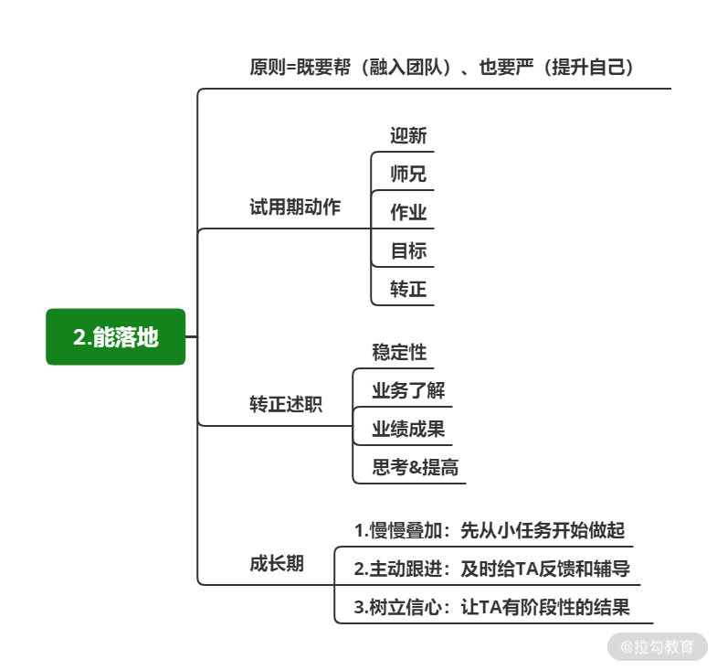

# 能落地：90 天试用期，转正时我们要考察什么？

## 简介 

新同学落地是一个很考验技术 Leader 认识是否到位的动作

做好落地的方法

1. 明确落地的整体节奏

2. 充电抓试用期考核以及工作习惯的养成

3. 转正结束后依然保持跟进

## 既要帮，也要严 

“帮”与“严”是双向要求

* 帮是指帮助新同学融入团队（针对的是师兄和 Leader）

* 严是要让新同学在团队中提升自己，遵守团队的做事原则，发挥自己的能力与价值（针对新同学自己）

**招聘只是开始，让新同学能落地、发挥价值才是最终目标**

## 明确新同学落地的整体节奏 

当新同学到岗之后，Leader 要快速明确这样几件事

1. 用迎新打破大家在情感上的壁垒

​		a. 熟悉办公环境

​		b. 介绍团队成员

​		c. 业务的基本情况

​		d. 说明公司的运作机制

2. 给新同学安排“师兄”

​		a. 司龄较长、责任心较强的同学

​		b. 新同学即将开发系统的搭档

​		c. 再或者是你自己

​		d. 以新同学转正期为准

3. **明确新同学的作业与目标（做出一些成绩达到转正）**

​		a. 一周时间内自己整理一个 A 系统的架构图、数据结构图

4. **明确告知转正应该怎么做（把转正做重、做实）**

​		a. check list

​		b. 即转正时，要达到什么程度

​		c. 比如胜任某些任务或者承担某些角色

​		d. 可以是独立开发某个系统

​		e. 或者分担你之前的部分职责

​		f. 承担核心开发的角色

这些产出会起到两个作用

* 作为新人落地工作的内容输出，同时在转正时可以作为产出物，佐证新同学的熟悉情况

* 作为团队内工作资料（方便其他新人落地），新同学既可以熟悉这些内容，再有新人入职时，也可以直接看这份文档，快速地了解系统，形成正循环

## 转正述职要考核什么 

不重视转正述职的隐患

* 面试通过 = 转正就稳，没有把本不合格的同学在试用期淘汰掉，不仅对团队不负责，也为未来埋下了隐患。

* 新同学入职初期，是他熟悉环境最重要的阶段，在该阶段没有让其建立合理的认识，没有建立团队的底线和标准。而且大家对工作标准的要求参差不齐的同时也减弱了团队凝聚力

**转正述职才是真正意义上的招聘结束**

如果发现找的人在实际工作中并不符合团队标准，那么你完全可以在转正述职阶段将其 Pass 掉，及时止损，技术 Leader 对转正述职的认识务必到位，这会决定你的团队能否长期发展。

考核的点

* 把控转正时间： 提前半个月跟 HR 或者“师兄”确定转正述职时间点

* 建立评委会： 由 Leader 主导，与合作伙伴（技术同学、产品或者运营)组成小评委会

* 明确考核内容： 硬性要求+软性要求

  * 硬性要求：对业务的了解程度、稳定性的学习

  * 软性要求：对业务的思考以及对技术的思考

## 成长期的跟进 

转正通过时，不少新人潜意识觉得自己通过了最难的一关，会放松下来，出现纰漏

**转正成功后的一年，是新同学能否快速成长最关键的一年**

转正后不放松对新同学的关注

* 慢慢叠加

  * 试用期主要做一些小需求、小任务

  * 成长期从负责小任务逐渐向负责大任务转变

* 主动跟进

  * Leader 要与新员工保持沟通，帮他分析问题，确定阶段性职业目标

  * 比如定期沟通他哪里可以改进、为他设定榜样确定可以参照和模仿的对象

* 树立信心

  * 转正述职阶段，大部分新人小心翼翼

  * 成长阶段要帮他树立信心，让他有阶段性成果，敢于发表意见

## 总结 

招聘到落地其实是生与养的关系

发挥招聘的价值让新人

* 学更快

* 更好的落地

* 发挥作用

