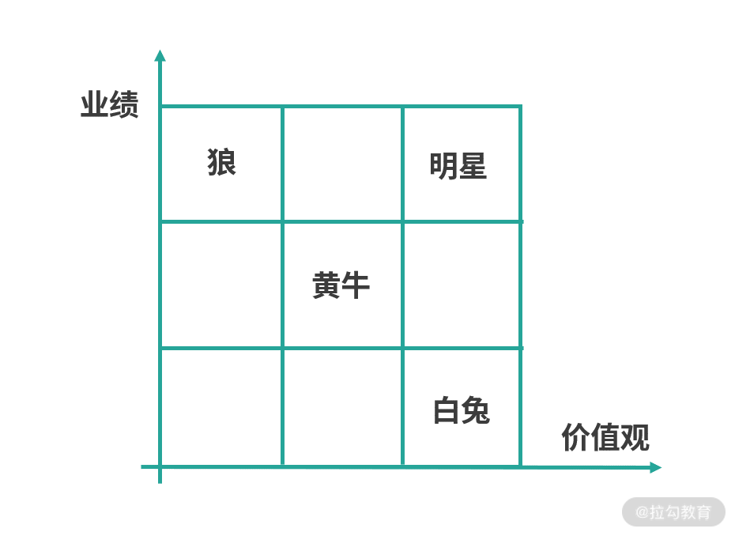
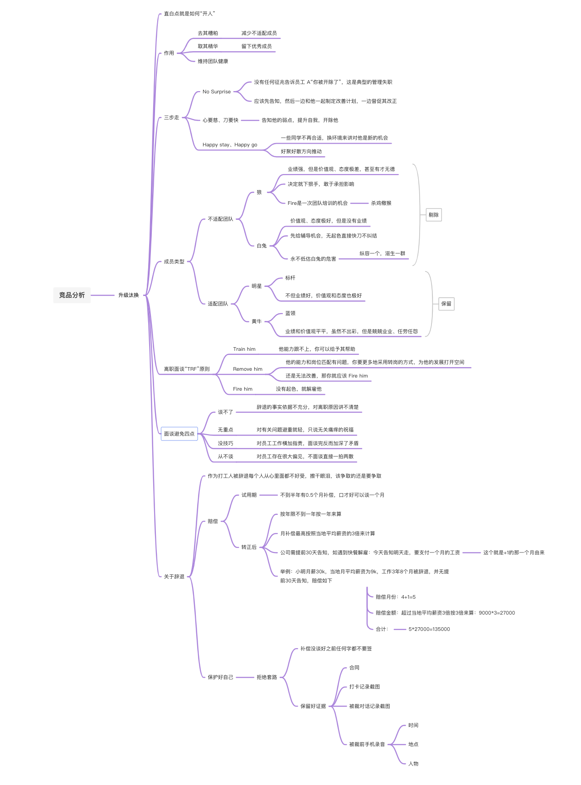
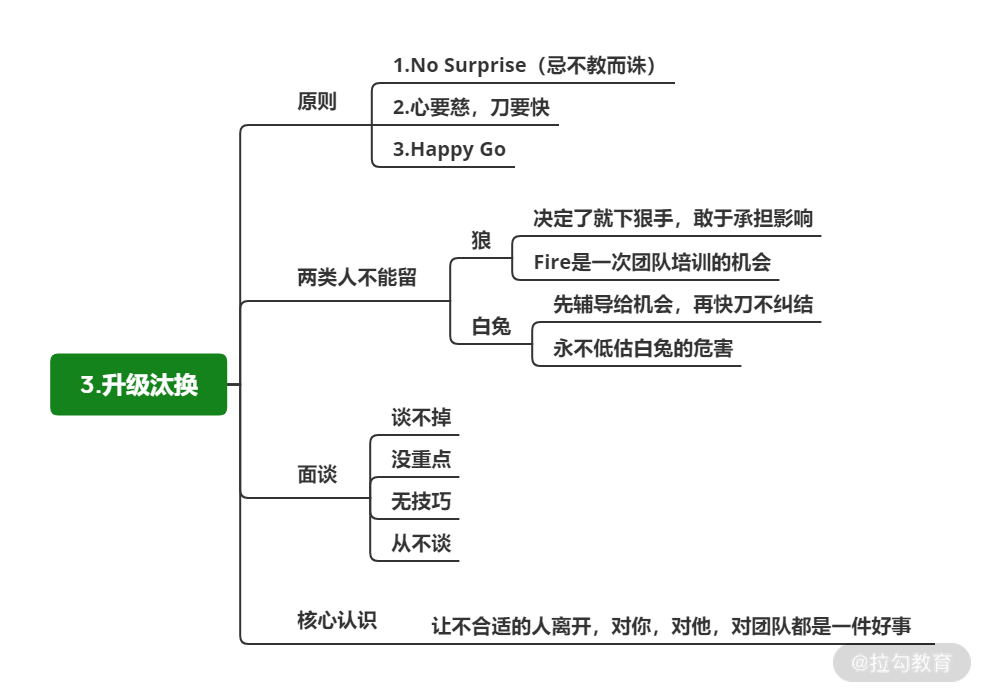

# 升级汰换：“心要慈，刀要快”

## 简介 

升级汰换直白点说就是“开人”

合格管理需要做的

* 不但要做好招聘

* 还要果断开除不适配团队的员工

* 维持团队整体的健康

* 真正对团队内优秀的成员负责

## 开除人“心要慈，刀要快” 

三个关键词

* No Surprise

  * 不要突然Fire一个人（离职一定不是一个突发行为），没有任何征兆告诉员工 A“你被开除了”，这是典型的管理失职

  * 如果A存在问题，你应该先告知，然后一边和他一起制定改善计划，一边督促其改正

  * 离职往往是一个可预期的结果，无法满足工作需要或者对团队有其他伤害而 A 依旧无法改变时

  * 为了避免对团队产生持久不利的影响，就需要让他离开

* 心要慈、刀要快

  * 如果你对一个人很不满意，却又不找他谈话，不要求他改进，又不开除他

  * 那么从最终结果看不仅对他很残酷，这种“拉锯战”对团队也是不负责任的

* Happy stay、Happy go

  * 送走一个同学对彼此来说并不是一件糟糕的事

  * 换个角度看，如果他在当前环境下一直无法适配团队，对他来说也是很难受的

  * 分开对他对团队都是解脱

  * 是当公司出现变化时，如果一些同学不再合适，换环境来讲对他是新的机会

  * 所以你不要存在太多的情绪，而是要往“好聚好散”的方向上推动

## 不要给“白兔”生存机会 

从业绩和价值观两个角度考察，把团队成员划分为 4 种类型

1. 狼

​		a. 业绩强，但是价值观、态度极差，甚至有才无德

​		b. 很可能为了达成目标，触碰高压线

​			ⅰ. 比如泄露公司机密、不服从组织安排、影响其他团队成员等

​		c. 甚至一个人会把一整个团队拖向深渊

​		d. **建议不要容忍这类员工，及时开除**

2. 明星

​		a. 不但业绩好，价值观和态度也极好

3. 黄牛

​		a. 业绩和价值观平平，虽然不出彩，但是兢兢业业、任劳任怨

4. 白兔

​		a. 价值观、态度极好，但是没有业绩

​		b. 看起来人畜无害，繁殖能力极强（不干活的好人）

​		c. 看着勤勤恳恳，但却拿不到任何结果

​		d. 如果你纵容白兔的存在，那么长久下去，很容易滋生一群白兔磨洋工

​		e. 前期可以给予改正的机会，如果依旧没有改善，应该毫不犹豫将其送走

## 离职面谈“TRF” 

### TRF 原则 

1. Train him

​		a. 如果他能力跟不上，你可以给予其帮助

2. Remove him 

​		a. 如果他的能力和岗位匹配有问题，你要更多地采用转岗的方式，为他的发展打开空间

3. Fire him

​		a. 如果在你给予他机会之后，他还是无法改善，那你就应该 Fire him

注意沟通的差异和重点

从当事人的情感上来讲，解聘还是一个被否定的动作

不同的人，可以采取不同的沟通策略

白兔

* 情感

* 道理

* 公司制度的顺序去沟通

* 因为他更多是能力问题，并且自认在态度上（努力与付出）非常多，所以被离职时更多是感情上接受不了，但是能力的事实又摆在眼

狼

* 公司制度

* 关键事情的道理

* 感情

* 他们是属于能力足够，但是并不为团队乃至公司整体考虑

* Fire 掉狼的过程，其实就是给团队培训的过程

* 间接地告诉员工，团队不能容忍什么类型的人，不能容忍什么样的事儿（杀鸡儆猴）

### 常见的问题 

* 谈不了：辞退的事实依据不充分，对离职原因讲不清楚

* 无重点：对有关问题避重就轻，只说无关痛痒的祝福

* 没技巧：对员工工作横加指责，面谈完反而加深了矛盾

* 从不谈：对员工存在很大偏见，不面谈直接一拍两散

如果团队成员有人被 fire 掉，对团队是很明显的教训、提醒和反思，要把这些事情公开透明的传达给你的团队的

### 案例分析 

> 💡 A：年轻、有热情、有潜力、肯拼，能力也强，最近发现他违反公司制度，通过 USB以及邮箱的方式在拷贝公司资料，公司发现后给了处分。

> B：踏实、勤奋、技术水平一般，原本是 PHP 但最近一年公司技术栈转 Java，他非常吃力。在 S1 的系统改造过程中，结果并不理想，上半年绩效是 C，虽然下半年你花了更多时间与他沟通，还特意安排了高年级的同学辅导他，但目前看依然很难达到期望的结果。

> C：技术骨干，之前是你的平级，后来因为你的管理半径扩大变成你的下属，不服气，经常在公开场合 diss 你，有时让你很下不来台。

> D：在公司做了 8 年，是技术骨干。1 年前因为组织调整转到你的团队。目前负责的业务不佳，今年会被砍掉，系统也要下线，团队中很难找到适合他的角色。

> E：技术专家，刚加入公司没多久，给团队带来很多不一样的想法。但他个性独立，说话直接，很多时候说话会比较伤人，他也觉得在团队约束太多，找不到同类人，landing 困难。

分析：

1. A：明显是要被开除掉的，因为它的诚信、价值观等高压线有问题，违反公司机密

2. B：也同样被开除掉，因为他的能力、结果不符合团队的角色要求且未能改善，本身没有成长，还会拖团队后腿

3. C：虽然公然 diss 你，但是对事不对人，对整体不对个体，C的能力是毋庸置疑的

4. D：不用开除，你可以考虑让他转岗

5. E：只是性格不合，可以与其做好磨合和沟通，不能开除

## 总结 

技术 Leader 要正确对待升级汰换

* 从团队的角度出发，正视而不回避

* 招聘厉害的人，会出现鲇鱼效应

* 解聘一个不合格的人，对团队发展的影响也是极强的

* 虽然短期很痛

* 长期来看，团队会得到更好的发展

