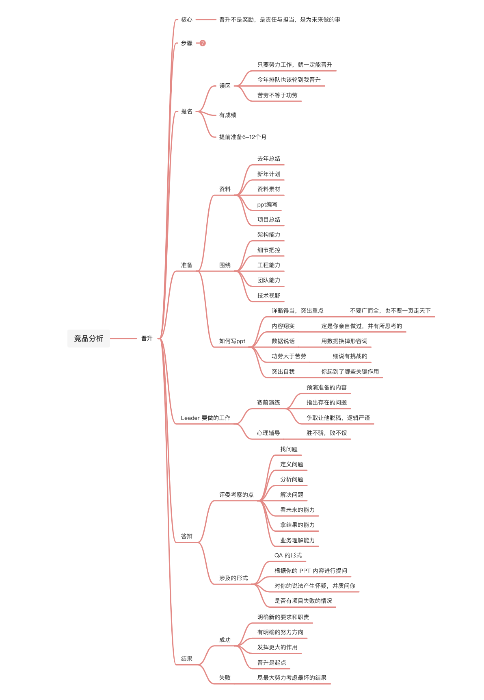
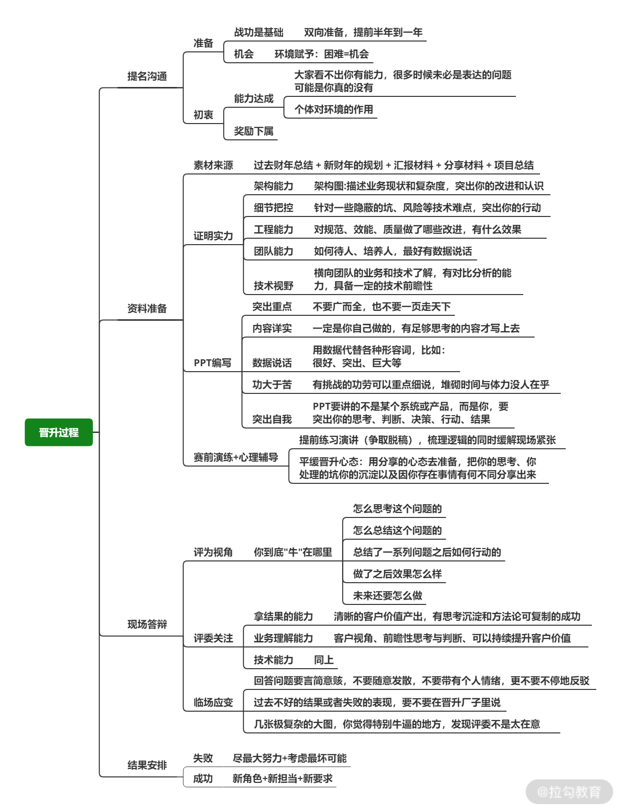

# 晋升：是不是技术到位、项目做好就够了？

## 简介 

掌握管理的基本框架和方法之后，怎么灵活运用？

* 结合工作中的常见痛点问题进行参照性的演练

思考：假设你已经开始带团队，需要给团队内同学做晋升

* 你的考察点是什么

* 怎么安排？

* 技术到位，项目做好就能晋升

## 经过多少“关”才能晋升？ 

大概步骤

晋升启动——主管提名——部门提报——述职答辩——结果表决——公司复审——结果公布

团队成员要达到优秀的绩效条件（在阿里全年下来是3.75），下一年才有提名资格

### 提名沟通 

注意准备期限，并为候选人安排合适的工作

团队同学形成提名的错觉

* 只要努力工作，就一定能晋升

* 今年排队也该轮到我晋升的感觉

**但大部分情况下苦劳不等于功劳，是否具备下一个角色所需要的条件才是晋升考核的侧重点**

* 不要为了奖励某个同学而让他去晋升

* 这不仅是对晋升这件事不负责

* 也是对这个同学和整个团队不负责

* 可以在薪资、年终奖等激励上体现自己对苦劳同学的关注

### 资料准备 

**资料**

* 资料素材来源

* 证明实力

* PPT编写

* 赛前演练与心理辅导

**围绕 5 个维度**

1. 架构能力：从业务或者现状复杂度以及你的改进切入，要有架构图做说明

2. 细节把控： 从一些隐蔽的坑、风险、线上问题或者技术难点来切入

3. 工程能力： 对规范、效能、质量做了哪些改进？有什么效果

4. 团队能力：如何带人？培养人？最好有数据说话

5. 技术视野：足够了解其他团队、其他BU、整个集团、甚至业界在这个业务领域的架构与技术，并对比出优劣

**编写PPT证明能力**

* 突出重点：不要广而全，十几页看不完，也不要一页走天下，答辩全靠讲；详略得当，突出重点

* 内容翔实：呈现的内容一定是你亲自做过，并有所思考的
  * 假设 B 项目很成功，而你只负责其中的数据监控，但你却夸大其词地突出了整个项目，这很容易给自己挖坑，评委问的问题你答不上来，不但会怀疑能力，还会质疑你的人品

* 数据说话：技术要习惯用数据说话**（面试项目介绍也可以这么写）**
  * 比如你优化了 B 系统，运行时间由 1分钟提升至10秒，为团队节省了500万，总而言之，用数据替换掉“很好”“突出”“巨大”等形容词**（用数字量化）**

* 功劳大于苦劳：晋升看中的是能力，有挑战的功劳可以细说
  * 如果你说自己为了完成 B 项目，一直在加班，那么这种堆砌时间和体力的表述没人在乎

* 突出自我：
  * 如果你提到某个产品或系统，那么评委关注的是你在这个系统中起到了哪些关键作用，你的思考、判断、决策、行动和结果

**Leader 要做的工作**

* 赛前演练
  * 在团队内部让有提名的同学预演一遍自己准备的内容，其余同学从中指出存在的问题（是否紧张、是否突出亮点……）争取让他脱稿，逻辑严谨，减少紧张感

* 心理辅导

  * 些同学会格外在意晋升这件事，患得患失，所以 Leader 要帮他平缓心态，帮助其建立正确的认知

  * 把晋升当作一次分享和总结，就当是对过去一段时间的回顾，不管结果如何，总有所收获

### 晋升答辩 

评委考察的点

* 找问题

* 定义问题

* 分析问题

* 解决问题

* 看未来的能力

* 拿结果的能力：清晰的客户价值产出，有思考沉淀和可复制的方法论

* 业务理解能力：客户视角、前瞻性思考与判断、可以持续提升客户价值

涉及的形式

* QA 的形式（Question Answer）

* 根据你的 PPT 内容进行提问

* 说法产生怀疑，并质问你

  * 回答问题一定要言简意赅

  * 不要随意发散

  * 更不要产生情绪

  * 不停地反驳评委

* 是否有项目失败的情况

  * 如果存在，那么你没必要抵赖，直接真实地说出经历，并表达自己过后的复盘与反思

  * 在评委提问时，也会很大程度上考验你的临场发挥，如果平时没有足够的积累和思考，这时很容易翻车

### 结果安排 

晋升答辩之后结果

1. 成功

​		a. 为其新角色明确新的要求和职责

​		b. 让他有更明确的努力方向

​		c. 在团队内发挥更大的作用

​		d. 不要把晋升当作终点，而是后面工作的起点

2. 失败

​	a. 考虑最坏的结果，避免形成落差，候选人离职

## 过去做晋升的一些感受 

**晋升不是奖励，是责任与担当，是为未来做的事**

一个同学晋升

* 是因为他有明确的战功

* 决策背后充分的思考

* 业务以及技术上深厚的沉淀

* 同时还具备未来发展潜力

晋升也是在对这个团体的其他人传递信号

* 我们要什么？不要什么？

* 推崇哪些人，认可什么结果？

* “榜样”应该什么样？

## 总结 

作者对晋升的理解

* 与其说是一个机会或者一件事

* 不如说是一套完整的人才梯队建设体系

* 从业绩到能力和潜力，缺一不可

* 好的晋升机制可以让团队越来越强，优秀的人承担更多的职责，发挥更大的作用

* 糟糕的晋升体系会让好的人才流失，糟糕的人“留下”，最终团队肯定是越来越弱的

