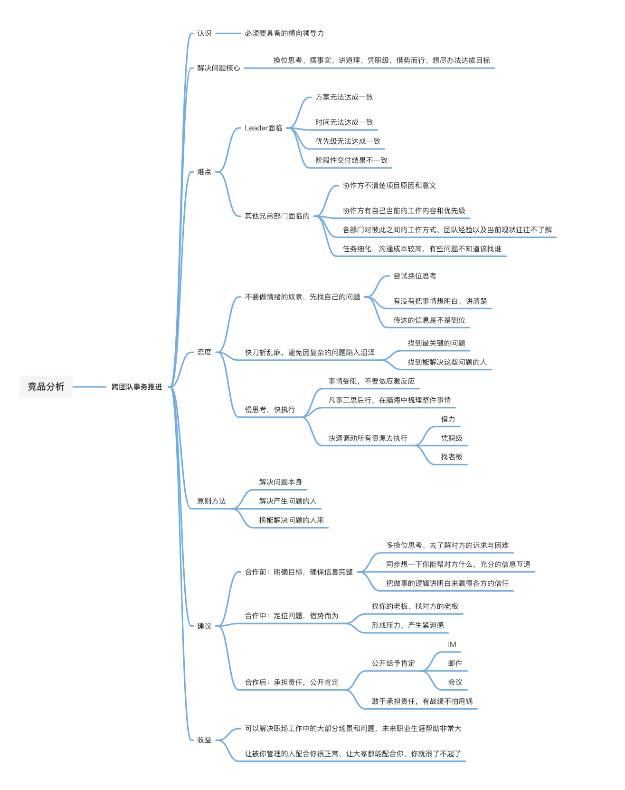
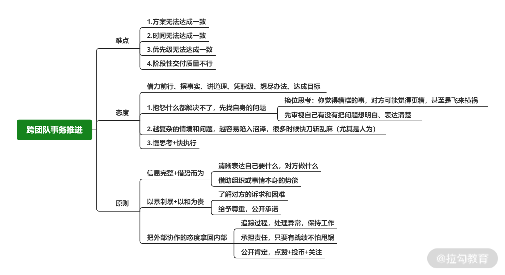

# 跨团队：没有汇报线的人和事就是推不动？

## 简介 

很多同学带团队之后，无法回避的一个问题就是“跨团队协作”

对于技术 Leader 这是一件日常工作

怎么认识“跨团队事务推进”，这是必须要具备的横向领导力

## 跨团队事务推进的难点 

> 💡 假设一种场景：公司要为即将迎来的“618”开启“电商购物狂欢节”活动，而你的技术团队需要担起“做好服务保障”“用新技术实现并提高用户购物体验”的重任，这次活动牵涉的兄弟部门较多，产品团队、业务团队、运营团队等，很多内容需要多个团队和角色一同确定并推进，既需要你配合其他人，也需要其他人配合你。

围绕“做好服务保障”你需要和其他技术团队一起确定

* 保障措施

* 可能发生的情况

* 照当前的职责准备应急的预案

**大部分技术 Leader 都会面临的 4 个难点**

1. 方案无法达成一致

​		a. 你提出的 A 方案与运营团队提出的 B 方案，在实现成本、方式、资源等方面存在很明显差异，陷入僵局

2. 时间无法达成一致

​		a. 协作方赞同 A 方案，但对“一周上线项目”的时间节点有意见，认为至少需要 20 天，这会从“时间无法达成一致”回滚到“方案无法达成一致”，陷入新一轮僵局

3. 优先级无法达成一致

​		a. 协作方赞同 A 方案，对项目用时一周也无异议，但该项目优先级在他那儿没有提到很高，一直有优先级更高的项目插队，导致交付时间一变再变、一拖再拖

4. 阶段性交付结果不一致

​		a. 因为某些原因（线上突发状况、同学请假、人员能力较差……），与你协作团队在配合时交付你的结果质量无法满足你的需求，比如运营给的方案有很大漏洞、技术给的接口 Bug 比功能点还多，你又无法直接管理对方团队的成员，最终即使更正了也可能浪费了额外的时间

**其他兄弟部门在需要你配合时，也会出现类似的问题**

* 协作方不清楚项目原因和意义，会优先考虑自身利益，根据利益高低推进难度由易到难

* 协作方有自己当前的工作内容和优先级，突然配合进行其他事务，引入的风险往往较高

* 各部门对彼此之间的工作方式、团队经验以及当前现状往往不了解

* 任务细化，跨团队合作受时间、空间等因素影响沟通成本较高，有些问题不知道该找谁

**你要做的**

* 树立正确的认识

* 再思考怎么解决

* **跨团队事务推进 是为了一起拿到更好的结果**

## 跨团队事务推进的基本态度 

先要摆正自己的态度，不然很难做好这件事

* 不要做情绪的奴隶，先找自己的问题

  * 下意识定义为外界因素

    * 环境有问题

    * 对方不配合

    * 公司文化糟糕

  * 抱怨解决不了任何问题

    * 尝试换位思考

    * 有没有把事情想明白、讲清楚

    * 该传达的信息是不是到位

* 快刀斩乱麻，避免因复杂的问题陷入沼泽

  *  假设在推进某类复杂业务时，产生了 A 问题，而你在解决 A 问题时，又会延伸出 B、C、D等问题，而你将所有的精力都用来解决一个个小的问题（甚至你根本不擅长的 B 问题），事倍功半；

  * 找到最关键的问题，并找到能解决这些问题的人

* 慢思考，快执行

  * 事情受阻时，不要第一时间做应激反应

  * 推不动和无法达成一致都是正常的

  * 凡事三思后行，在脑海中梳理整件事情

  * 快速调动所有资源去执行

    * 该借力就借力

    * 该凭职级就凭职级

    * 该找老板就找老板

## 跨团队事务推进的原则方法 

**解决“跨团队事务推进不畅”三种维度**

1. 解决问题本身

​		a. 把问题解决掉

2. 解决产生问题的人

​	a. 搞定制造问题的人

3. 换能解决问题的人来

​	a. 换能解决这个问题的人来解决

**换位思考、摆事实、讲道理、凭职级、借势而行、想尽办法达成目标**

**从作者经验出发，提几点建议**

* 合作前（明确目标，确保信息完整）

  * 在沟通时，很容易直接说“接下来要改造 A 系统，希望你配合我做……”忽略了合作前的信息互通。我建议你先梳理项目目标，搞清楚为什么要“改造 A 系统”？这个项目对产品、运营、业务三个团队的重要性是怎样的？它们能通过“改造 A 系统”获得哪些价值？它们需要配合的程度？做成会有什么结果，做不成又有什么结果……总之，你要把所有已知的信息给到对方，并换位思考，寻求平衡

  * 团队毕竟不同，诉求也不同，尽量秉持友好与中立的沟通态度

  * 多换位思考、去了解对方的诉求与困难，不要总想着让对方帮你什么

  * 也同步想一下你能帮对方什么，充分的信息互通

  * 把做事的逻辑讲明白来赢得各方的信任，制造良好的协作氛围

* 合作中（定位问题，借势而为）

  * 出现问题在所难免，保持冷静的态度去分析和处理

  * 比如某件事儿你做完了，需要 B 团队继续，B 团队遇到困难或者犹豫不决，或者有些问题你无法解决时，要借助这件事情的势能

    * 找你的老板、找对方的老板

    * 形成压力也是一种方式，比如 C 团队还在等 B 处理完的结果，那么 B 夹在你和 C 团队之间，自然会有一种紧迫感

* 合作后（承担责任，公开肯定）

  * 不要忘记合作伙伴的支持与帮助

    * IM（instant messaging）即时通讯

    * 邮件

    * 会议上公开给予肯定

    * 为下次更愉快地合作留下基础

  * 如果结果不理想，也要敢于承担责任

    * 不做甩锅侠

    * 谁也不想未来和遇到问题就甩锅的人合作

## 总结 

谈合作

* 跨团队合作”这件事无法避免，项目推进也十分复杂

* 永远不要以为别人配合你是天经地义的事情

* 针对不同的问题寻找他们的关联，探寻最关键的破局点

谈收益

* 跨团队的事务推进很难，但也最锻炼人

* 能把这些事做好意味着你能解决职场工作中的大部分场景和问题，对未来职业生涯的帮助非常大

* 让被你管理的人配合你很正常

* 让大家都能配合你就很了不起了

