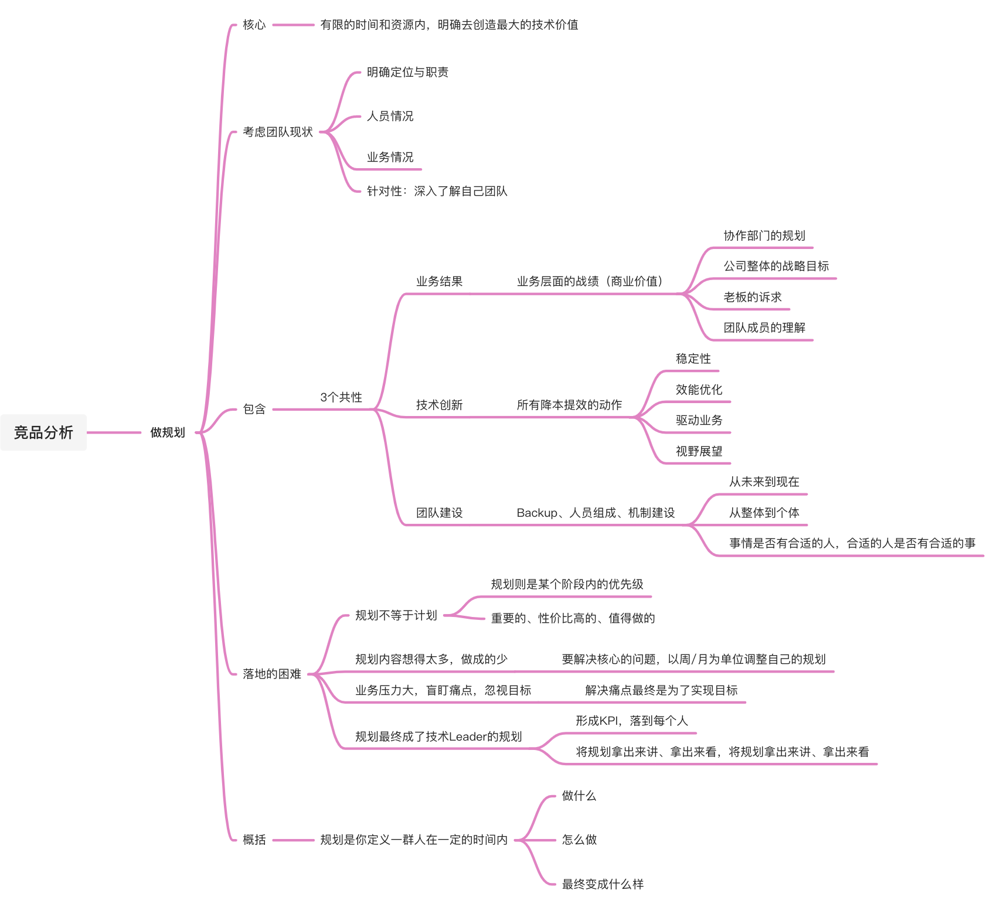
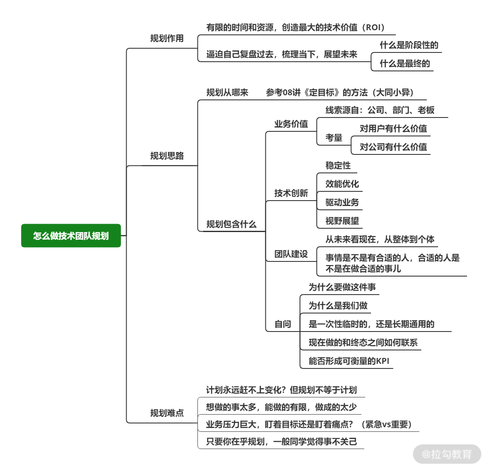

# 做规划：除了交付和稳定性，还要规划什么？

> 💡 OCR：即文字识别是指电子设备（例如扫描仪或数码相机）检查纸上打印的字符，然后用字符识别方法将形状翻译成计算机文字的过程
> GMV：指商品交易总额

## 简介 

技术团队的规划存在两种情况

1公司制度需要做规划上报

2Leader 主动做团队规划

团队规划解决的核心问题是：**让你在有限的时间和资源内，明确怎么去创造最大的技术价值（ROI）**

## 做规划要考虑团队现状 

针对团队现状的梳理，可以从这几方面切入

* **明确定位与职责**： 你的职责以及团队的定位是什么？公司对你们的期望是怎样的？你与上一级目标的关联点在哪？

* **人员情况**：成员能力、团队结构、团队规模以及当前团队负载

* **业务情况**： 业务当前的侧重点是什么？阶段性目标如何？业务的执行计划是怎样？技术能解决的痛点在哪？

规划在开始之初

* 就应该对优先级（轻重缓急）有一个考量的原则

* 深入了解自己的团队，才能针对性地去明确规划核心、丰富规划内容，更容易落地

## 你的规划中包含了什么？ 

提炼成共性的3 部分

* 业务结果：直白说就是业务层面的战绩
  * 你团队打造了一个公司 GMV 占比超过 50%的商城，或者支撑了某个快速发展业务，这些都是业务结果，用业务数字来说话

* 技术创新：由技术人员发起或完成的所有降本提效的动作，但是同样要看优先级和投入产出比

* 团队建设：让团队可以长期健康发展下去，要在 Backup、人员组成、机制建设等多个方面下功夫

在你拟定每一个规划分支时，都需要自问这样几个问题

* WHY：为什么做业务目标/技术创新/团队建设的规划？

* WHAT：是否能说明业务目标/技术创新/团队建设规划解决的问题、价值与作用？

* WHO：由谁承担？负责人的优势与跌势是什么？

* WHEN：所做的规划着眼于现在还是未来？能否保证长期有价值？

* HOW：针对不同的部分，具体的落地细则如何？

* HOW MUCH：规划要做到什么程度？是否可以形成可衡量的KPI？

### 业务结果 

大部分的技术团队都是用来服务于业务，为了创造更多的业务、商业价值

要想制定业务价值方面的规划

* 协作部门的规划

* 公司整体的战略目标

* 老板的诉求

* 团队成员的理解

### 技术创新 

稳定性、效能优化、驱动业务、视野展望

从几个最痛的点去着手

* 工具

* 流程

* 新技术

**技术驱动业务**

视野展望对新技术的敏感和接受程度，决定了你团队的技术上限

可以定期关注业内的新技术发展

对于技术趋势你如果不能成为主导或推动者，最起码要紧跟步伐

### 团队建设 

> 💡 假设你现在带了三个月的团队，开始做团队规划，在团队建设这里的核心重点就在于从未来看现在，从整体到个体，比如团队有 8个人，你的重点是不是考虑“未来怎么把团队的 8 个人用好？怎么安排他们做合适的事情呢？”并不是

团队建设的关键

* 团队未来需要什么样的人？

* 目前团队成员需要什么样的状态和能力？

* 团队成员需要承担什么样的责任？

* 从未来到现在，从整体到个体

**总的来说，你希望未来自己的团队成为怎样的团队？以此推导离理想状态多远？怎么缩小差距？**

* 缩小差距的过程就是整体到个体的过程

* 核心在于思考团队的未来和终态如何，反推每个人、每件事

## 规划落地时的问题与思路 

* 规划不等于计划

  * 计划是一张时间表，它严丝合缝，不能打乱

  * 规划则是某个阶段内的优先级，做规划是为了让你知道哪些是重要的

  * 是盘点技术价值的过程，而非执行的过程

* 规划内容想得太多，做成的少

  * 不是囊括万物，要有落脚点

  * 要解决核心的问题，以周/月为单位调整自己的规划

* 业务压力大，盲盯痛点，忽视目标
  * 解决痛点最终是为了实现目标

* 规划最终成了技术Leader的规划

  * 目标规划一定要形成 KPI，落到每一个人身上，让每一个人都跟结果息息相关

  * 一定将规划拿出来讲、拿出来看，每周带领团队成员查看进度，同学们一定会重视

## 总结 

做团队规划是一件比较综合宏观的事情

规划是你定义一群人在未来一段时间内

* 做什么

* 怎么做

* 最终变成什么样

* 定期梳理并落地（一个季度或者半年内）

* 有目标和没目标的团队，还是有很大的差别的

