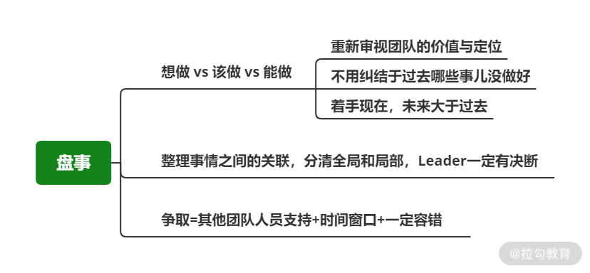
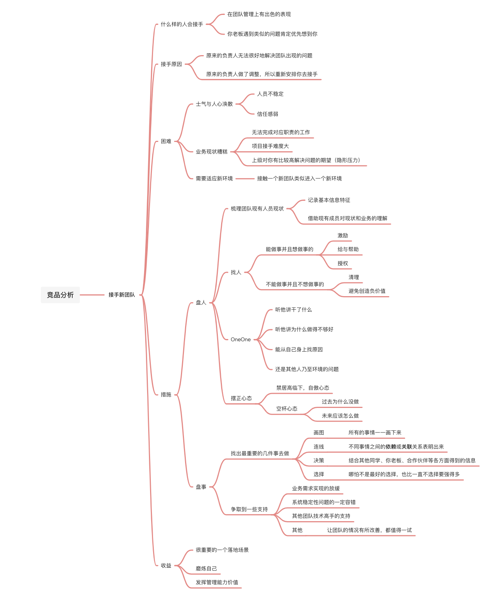
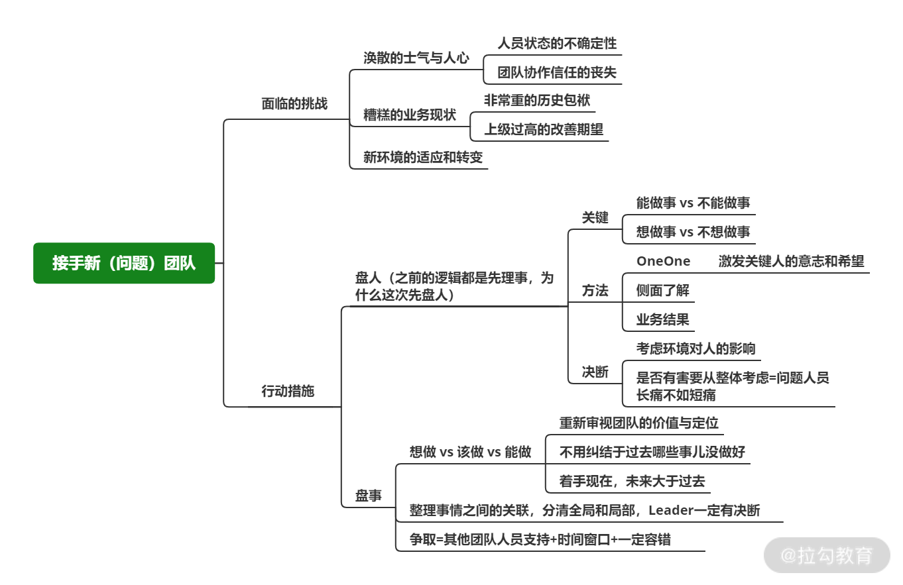

# 接手新团队：士气低、交付迟、事故多发，如何下手解决？

## 简介 

* “接手新团队”是比较综合且棘手的场景之一

* 在团队管理上有出色的表现的同学，越容易遇到这种情况

## 困难挑战 

接手的原因

* 原来的负责人无法很好地解决团队出现的问题

* 原来的负责人做了调整，所以重新安排你去接手

### 团队内涣散的士气与人心 

* 团队情况恶化的时间长

* 优秀的同学也会因为这个糟糕的环境而选择离开

* 人员调整增加了人员的不确定性

* 团队成员信任感非常弱

### 糟糕的业务现状 

* 无法完成对应职责的工作

  * 需求无法交付

  * 系统稳定性无法保证

* 项目接手难度大

  * 很多实现与功能已经一塌糊涂

  * 难以在未来进行迭代和维护

* 上级对你有比较高的解决问题的期望（压力）

### 自身的适应与改变 

* 接触一个新团队类似进入一个新环境

* 依赖过去经验
  * 影响判断的也是过去的经验

* 经验要随着场景变化而变化

## 行动措施 

一边盘点一遍想办法，尽早行动得到反馈

### 盘人 

1. 把团队的人员梳理干净

2. 记录人员的基本信息和特征

3. 借助现有成员对现状和业务的理解

4个象限

* 找出两类人

  * 能做事并且想做事的

    * 是我们最需要的，接下来能否扭转局面的关键

    * 要给予包容，想办法帮助并激励他，给他权限为他创造机会

  * 不能做事并且不想做事的

    * 需要尽早清理出团队的，不能给他再作妖的机会

    * 避免继续创造负向价值

* OneOne

  * 比如张三在团队中负责 A 系统的开发，A系统线上问题频发，需求完成的质量非常糟糕，那么其他人再怎么为他点赞，与你沟通得再顺畅，你都要多思考一下，为什么说得这么好但是结果完全不一样？OneOne 的时候**不仅要听他讲干了什么，也要听他讲为什么做得不够好。是能从自己身上找原因，还是大部分点都认为是其他人乃至环境的问题**

  * 这对你判断一个人是否“靠谱”很有帮助。并且很多时候如果真的是受环境或者其他情况影响导致事情的结果不理想，那么自身也会有足够的思考，而不是甩锅似的一点想法都没有

* 摆正自己的心态

  * 居高临下的自傲心态

    * 现团队的同学沟通时一定也同步摆正自己的心态，并不是说你过去的经验都是对的，他们做的全是错的，然后你带着正确答案来拯救他们了

    * 大概率最后要做砸，并且也没人愿意和你一起做

* 保持空杯心态

  * 探究过去为什么没做，未来应该怎么做

  * 团队成员也会感受到你到底是他们的一分子，还是来指责、批评、教育他们的

### 盘事 

两个方面入手

* 找出最重要的几件事去做

  * 比如你看到很多过去的需求实现的方案都是有问题或者有缺陷的，那有没有一一更正吗？

    * 大概率是没有必要的

    * 除非这个问题发生的概率以及可能造成的影响都足够巨大，否则不如先不动

  * 梳理出清晰的脉络和头绪

    * 在白板上把所有的事情一一画下来（画图）

    * 通过连线的方式把不同事情之间的依赖或关联关系表明出来

    * 结合其他同学、你老板、合作伙伴等各方面得到的信息，做出一个**判断**或者**说决策（即这个团队下一步做什么）**

    * 有时候哪怕不是最好的选择，也比一直不选择要强得多**（选择比不选择强得多）**

* 在做的过程中争取到一些支持（上级和其他团队，会哭的孩子有奶喝是真的）

  * 一段时间内业务需求实现的放缓

  * 对线上系统稳定性问题的一定容错

  * 其他团队技术高手的支持

  * 结合你的实际情况去寻求支持，只要能让团队的情况有所改善，都值得一试

## 总结 

* 接手一个问题团队会有许多困难，需要处理很多问题会非常辛苦

* 是对一个 Leader 的锻炼也是无与伦比的

* 所有优秀的技术 Leader 都是一次次这样磨炼出来的

* **技术管理能力很重要的一个落地场景就是这种情况（接手新团队）**

* 也是最能发挥技术 Leader 管理能力价值的场景之一

