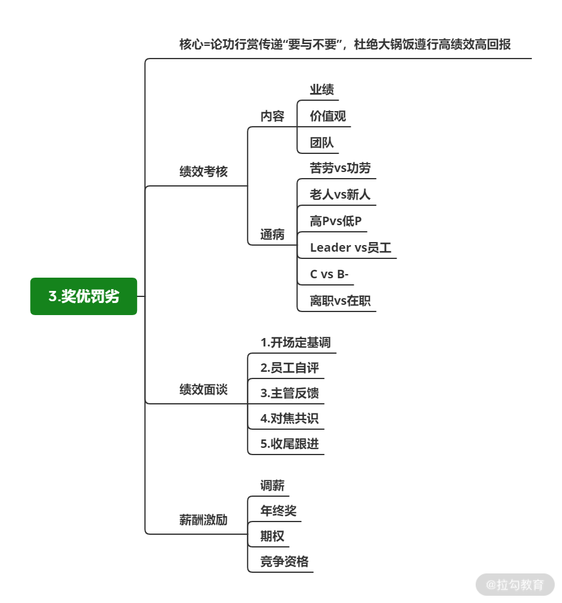

# 奖优罚劣：怎样传递我们"要什么"与“不要什么”？

## 简介

把拿结果比作种菜

定目标 => 筛选种子  => 确定最终要种什么

追过程 => 看种子生长发芽、浇水灌溉 => 对过程进行持续管控和追踪

奖优罚劣 => 给种子施肥（优），洒农药（劣） => 保证这片土壤（团队）在未来还能继续播种、结果，进入良性循环

**引导人性而非对抗人性，不受主观情绪影响**

## 什么是奖优、罚劣 

奖优：通过一些具体的动作（调薪/晋升）告诉大家团队选择什么样的人，鼓励什么行为

罚劣：表明团队不需要什么样的人，不能容忍什么行为

**本质：传递团队要什么和不要什么**（论功行赏，按结果问责）

奖优

* 物质上作用大，频次较低

* 精神上体现日常行为，频次较高

罚劣

* 是动作而非目的，以此提醒、鞭策大家

一些误区

* 没有意识到奖优罚劣的示范作用：发挥示范作用，引导团队风向

* 注重罚劣，忽略奖优：惩罚带来的是负面的能量和情绪

* 奖惩动作过于儿戏，容易被滥用：“奖惩”不是宣泄情绪与不满的动作，要带有目的性

## 奖优罚劣的关键动作 

### 绩效考核

要形成具体的 KPI **要通过绩效考核清晰地将我们“要什么，不要什么”明确、公开且坚定地传达给所有人**

互联网公司的考核

* 361 比例

* 271 比例

* 划分出绩效等级（A、B、C）

几个考核陷阱

* 新人和老人之分

* 高 P 和低 P 之分

* Leader 和成员之分

* 离职和在职之分

**核对于技术 Leader 而言是一个给团队做体检，问题多不可怕，不知道问题、看不出问题、对问题视而不见才真正可怕**

### 绩效面谈

需要谈的

* 考核与成员自评间的分歧在哪儿

* 以后要怎么提高或改进

* 最终的共识是什么

有相对正式的感觉

* 开场定基调：接下来要谈什么、怎么谈、过程是怎样的

* 员工自评：听员工讲自己对绩效的理解，以倾听为主

* 主管评价：结合考核结果和员工自评内容，逐条说出打分的Why，出你的观察、你的思考

* 对焦共识：员工自评与主管评价会有落差，分歧要一条一条地聊透

* 面谈总结 & 后续跟进：面谈结束后你一定要有所行动

* 遇到倾心激动，要保持清醒，不可陷入情绪化对抗，可以体谅但不能对结果妥协

### 薪酬激励 

互联网公司中研发薪酬组成

* 月薪（调薪）

* 年终奖 

* 期权

其他

* 晋升

* 职能

**如何分配这些资源为未来创造价值对你来讲就成了考验**

三个基本原则

* 问自己是否敢将**资源分配的逻辑与规则在阳光之下讲出来**，做到透明你具备可以正面讲出来的能力

* 不要撒胡椒面，也别做大锅饭，对于非常绩优的同学，参照8/2原则，也可以给到超预期

* 面向未来而非现在去做考虑，必须有取舍

## 总结

奖优罚劣听起来很简单，但是往往做起来并不容易，因为我们很容易先入为主，受到主观情绪的影响

非物质的精神激励也需要做推广

1. 对优秀行为的认可与推广
1. 为优秀的同学在更大范围内制造影响力
1. 树立榜样去影响这个团队

做“奖优罚劣”会影响的不单单是你今年的事情，还会影响你团队明年的发展

