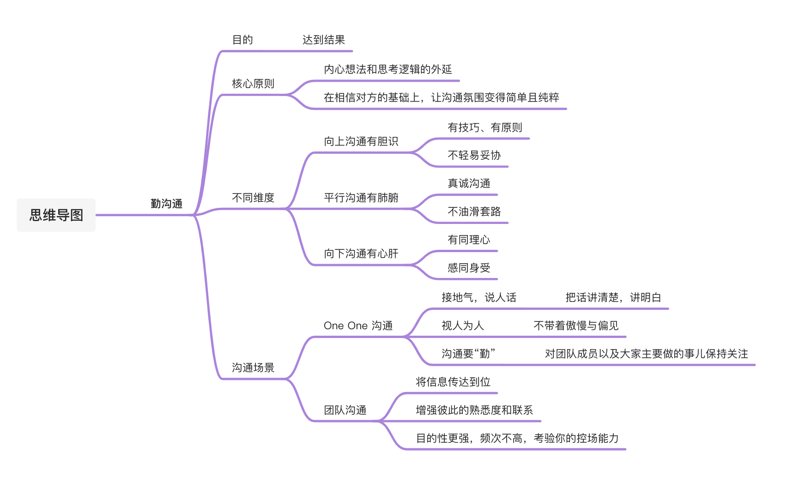
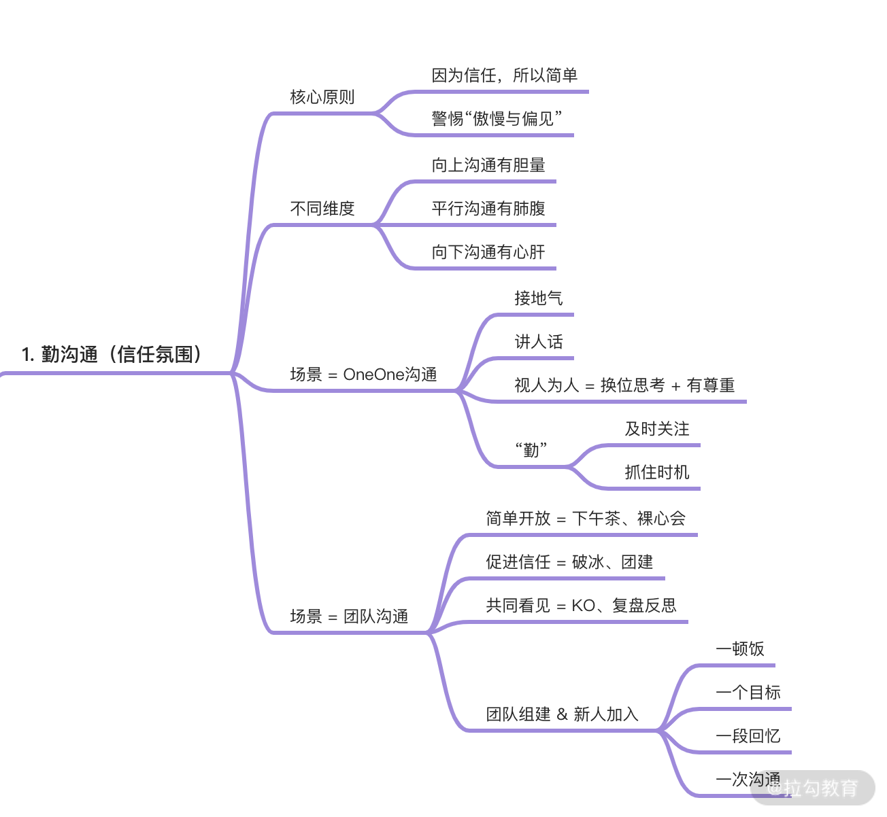

# 在信任的基础上，让沟通简单且纯粹

## 简介

目的：通过沟通去达到一定的结果，要懂得一定的道理与技巧

对技术 Leader 来讲，沟通是每天要做的事儿，不限形式、场合

沟通是一件说起来容易，做起来又难又累的事情

* 与个人性格

* 习惯

很多人沟通上的问题

* 被主观情绪影响

* 凭感觉沟通缺少技巧

 

## 沟通的核心原则 

沟通是**内心想法**和**思考逻辑**的外延

不可取

* 过滤信息，让团队内存在信息差（Leader 知道团队成员不知道的事情）

沟通核心原则：**在相信对方的基础上，让沟通氛围变得“简单且纯粹”**

 

## 不同维度的沟通 

不同沟通的维度

* 向上沟通有胆量

* 平行沟通有肺腑

* 向下沟通有心肝

### 向上沟通

**向上沟通要有技巧、有原则，认清沟通的目标与目的，不轻易妥协导致更严重的后果**

例子：

比如 618 大促项目会上，你所在的团队要针对营销新玩法做对应的实现，当你和团队成员已经提出一套方案后，老板也给出了另一套方案，并且认为新方案的实现成本更低。可是以你对系统的了解，虽然新方案实现成本低，在现阶段也不会出现硬伤，但其中存在很多隐蔽的细节，后续迭代会很痛（比如新增的津贴玩法看起来可能与红包类似，但如果用红包系统做津贴的底层实现，两个业务在系统上就被耦合了，当未来业务有变化时还是要拆分，并且在这个过程中增加很多不必要的风险）。那么这时你是在会上直接指出他的问题？还是在会后单独找他对焦呢？

做法：

* 如果你确定方案本身存在很严重的问题，我建议你在会上提出。

* 但项目以及沟通的目的是事情本身，事情要搞砸了，再顺畅的沟通都没有意义。

* 开会的目的就是为了让大家达成一致，项目成员有一个统一认识

* 如果在会后立刻推翻其实会对项目本身的节奏有所伤害，很容易造成信息混乱，认识不一致。

### 平行沟通 

**平行沟通有肺腑是指你要真诚沟通，不要油滑套路**

例子：

之前我们每个月有产品会，CEO 以及各部门负责人会在此确定业务需求的优先级。然而有时确定优先级之后，业务方可能会私下找你表示目前有一个业务需求很重要，希望技术团队能帮帮忙，甚至加班想办法支持下。

不可取的的做法：

会套路地回复：技术资源有限、老板已经确定了优先级、自己无法做主”“会找产品看一下

* 导致：认为你没有担当，甩锅

* 就是很差的沟通体感

好的做法：

* 抱着解决问题的态度与其沟通

* 尝试着重新梳理资源或在你的职权范围内微调项目优先级

* 或者进行需求的合并

* 又或者借助其他团队的力量完成这件事儿

* 如果实在解决不了，再跟业务方共同努力寻求一个最佳方案

* 总之，你能不能解决是一回事，但你是不是真的想帮他解决问题又是另外一回事儿

* 对方是能感知到这两者的区别的

* 非直言不讳，而是直言有讳

### 向下沟通

**向下沟通有心肝是指有同理心，有尊重的同时要感同身受**

例子：

比如，新同学入职 3 个月，在一次需求发布上线后，变更出现 Bug 导致系统宕机，连带你受到了上级的批评。这时你要用怎样的态度和方式与新同学沟通？是把他也狠狠地批评一顿，顺带把自己的情绪转移出去，还是看他已经很难过了，于心不忍，反而安抚他一下

不可取的做法：

* 把他也狠狠地批评一顿，顺带把自己的情绪转移出去

​		○ 情绪宣泄，没有任何意义，只会造成团队内的信任错位

* 看他已经很难过了，于心不忍，反而安抚他一下

​		○ 无法让犯错误的同学认识到这件事的严重性，沟通对未来没有改变

好的做法：

严肃但是不情绪化地做沟通，围绕事情本身来沟通，客观地表现出自己的态度，并告诉犯错方事情的严重性。

## 两个具体的沟通场景

### One One 沟通 

不应该有特定的时间和场合，无时无刻、无处不在

* 接地气，说人话

​		○ 把话讲清楚，讲明白才是最重要的，而不是用词多么高深，立意多么深远

* 视人为人（不要带着非常主观和情绪化的认知去沟通）

​		○ 不带着傲慢与偏见，用居高临下的态度去责问与命令，只会把自己与团队割裂开

* 沟通要“勤”

​		○ **这里的“勤”并不是单纯指时间和频率，而是说，你要一直对团队成员以及大家主要做的事儿保持关注，当发现一个合适的契机后就主动发起沟通**

列子：

* 比如有同学最近状态不好，经常迟到早退，那可能是家里出了问题

做法：

* 此时一个简单的沟通既可以给对方提供一些帮助，也可以更稳妥地安排手里的工作

列子：

* 有同学因为一个项目协作和其他团队发生了一些不愉快

* 此时你去找他聊如何对外沟通、如何推进项目、如何搞定分歧，他肯定更加感受深受，并且立刻就有实战的机会

### 团队沟通

团队沟通受人数的限制，是一对多的沟通，**最关键的应该是搭场子**，发起团队沟通

什么时候组织

* 新组建团队

* 新人加入

* 年度考核

* 事故复盘

* 团队现状和后续发展会出现很大的变化时

作用

* 将信息传达到位

* 增强彼此的熟悉度和联系

目的性更强，频次不高，考验你的控场能力

例子：

在饿了么和阿里，当团队有新人加入的时候，大家会一起吃个饭，一起定个计划，整个团队做一次沟通。我刚组建中台研发团队时，就把团队中**直接汇报**给我的成员，拉到一起，找个地方，大家吃个饭，然后从下午聊到深夜。每个人都谈谈自己的经历、谈谈目前的团队和业务的现状、谈谈那些想吐槽、想改变的，也集思广益地凑一凑我们一起接下来要做什么、怎么做。那次沟通已经过去2年了，但是我依然印象深刻。

## 总结

沟通是聆听、发问、一边说、一边听，表达自己的想法

沟通技巧：接地气、讲人话、视人为人、不偏见、不傲慢、真诚地去建立信任和联系

