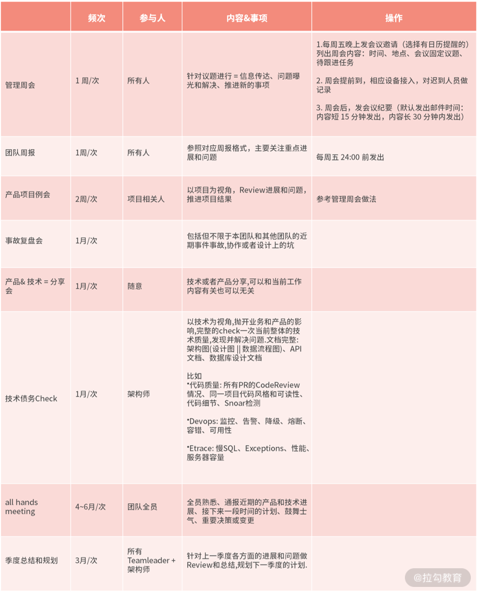
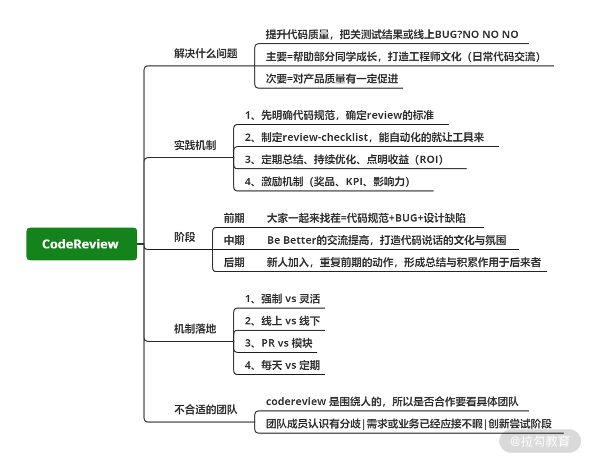
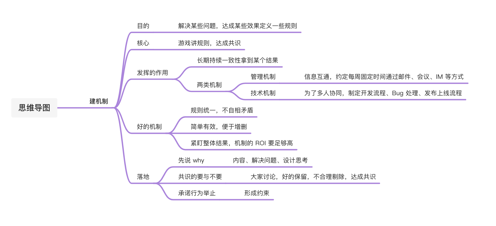
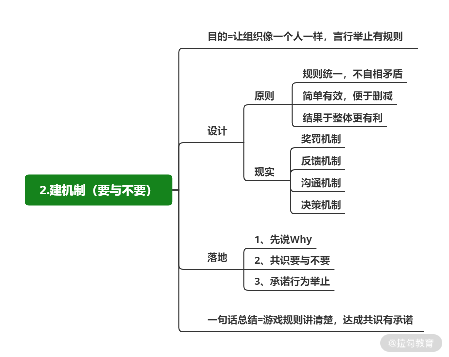

# 建机制：规则流程越建越多，为何效果却越来越差？

 

## 简介 

为了解决某些问题、达成某些效果会定义一些规则，希望人和事物发展在规则内进行和处理，这就是一个建立机制的过程。

机制的落地

* 人

* 流程

* 工具

* 信息

## 机制发挥什么作用？

 

为了长期、持续、一致地拿到某个结果

两类机制（机制的具现）

* 与管理相关

​		○ 信息互通，约定每周固定时间通过邮件、会议、IM 等方式，将提前定义好的信息做一个汇总交互（表现为周报、周会等）

* 与技术相关

​	○ 为了多人协同，制定开发流程、Bug 处理、发布上线流程

“建机制”就是当你要**长期持续地处理一些问题时**，需要跟解决该问题的相关人**针对怎么处理问题达成一致**，然后按照约定的方式去执行

**站在团队的角度，建机制尤为重要，你要通过机制让团队有统一的行为与规则，让组织像人一样，言行举止有规律可循**

 

## 如何设计一个好的机制？ 

建立机制三个关键点

1. 规则统一，不自相矛盾

​		a. 机制定义明确、清晰、统一

​		b. 比如：定义“每周任务安排”的机制，规定：每周一下午2:30，团队成员以先认领再分配的方式确认本周内容，并商定交付时间、标准，在会后将结论统一记录并公布（通过 PM 工具或者邮件、文档等方式）

2. 简单有效，便于增删

​		a. 一定要围绕某一个要解决的问题

​		b. 比如：一个处理慢 SQL 的机制，在如何定义慢 SQL 时，如果有 N 种满足条件需要人为处理，那么执行起来就会很困难。所以，你可以先定义 2~3 个条件，比如时长超过 xxx 毫秒，调用次数超过 xxx 次，先让机制跑起来可以处理问题，再慢慢优化

3. 紧盯整体结果，机制的 ROI 要足够高

​		a. 一定要站在整体和长期的视角去看，去看它对每一个人和团队的影响

​		b. 比如：有的 Leader 为了最大程序掌握团队的开发工作，要求每人每天按照一定的格式书写日报，然后由他进行汇总。也许这个机制确实会帮团队发现一些问题，但也会增加低价值工作量，成员大量的时间在做计划和总结却没有精细化执行，很多时候为了解决 A 问题却产生了 B、C、D 等问题

工作中树立机制

* 奖罚

​		○ 参考 10 讲

* 反馈

​		○ 线上问题的处理很典型，当发现线上出现异常时，怎么把相关信息反馈到对应的负责人

* 沟通

​		○ 形式非常多，比如会议、周报、OneOne

* 决策

​		○ 需要很多人针对某一个问题给出具体的答案，比如决定某一个技术方案

## 机制要怎么落地？

 

将团队成员拉到一起开会讨论，主要聊 3点内容

* 先说 why：机制的内容是什么？为了解决什么问题？你在设计机制时是如何思考的？

* 共识的要与不要：和大家讨论我们要不要这样做？看看大家是怎么想的，通过对话和引导形成一定的结论，有些内容需要保留，有些不合理需要剔除，促成结论最为重要

* 承诺行为举止：确认机制后，要让结论形成对各自行为的约束

## 案例详解 

### 信息互通的会议

  

会议是往往是重要信息沟通、讨论、同步的首选方式，很多重要机制的落地都会涉及会议的方式，这里我单独把技术涉及的周期性会议罗列出来。

你可以看到基于不同的目的所举行的会议在时间、参与人、内容上都有所差别。作为技术Leader 要先掌握怎么开会，以及开什么样的会，合理的会议安排不仅让事情更加有条理，也便于团队成员参与。

### 如何做 CodeReview

 

解决两方面的问题

1. 提高代码质量，帮助开发同学认识到如何写出更好的代码

​		a. 打造团队内的技术提升氛围

2. 不同的侧重点设计出来的产品机制也有所不同

​		a.  促进产品质量的提升

并不适合所有的团队

1. 团队成员对其产生很大的分歧，产生极大的内耗

2. 需求和业务已经应接不暇，生存很困难

3. 团队处于创新和尝试的阶段，并不稳定

**任何一个机制都不会存在永久化收益，不是说在 A 团队的机制，放到 B 团队就一定会好。**

## 总结

  

* 建机制在某种程度上就是为了解决“群策而不群力”的问题

* 每一个机制的创建都存在成本

* 如果一个组织内名存实亡的机制过多，那么大家对机制的认识和执行都会越来越差，最终团队会一盘散沙、毫无凝聚力

* 设计良好的机制会让团队整体的执行力提升，并且最大程序的将每个人的能力与特长整合起来

