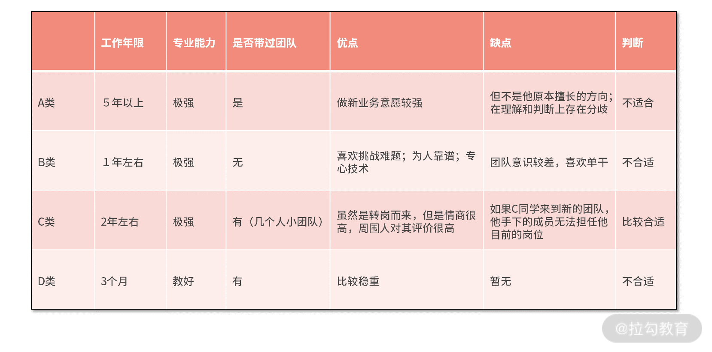
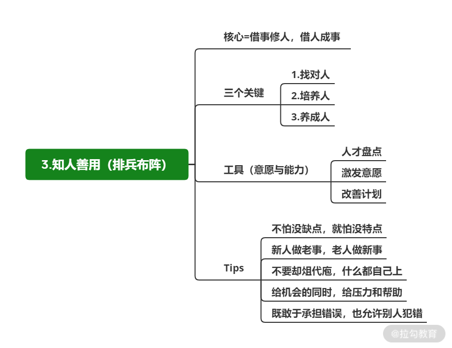

# 知人善用：借事修人，借人成事

 

## 简介

想将机制落地，首先要建立足够的认知，让人在团队运作中，发挥最大的作用，进而取得更好的结果

知人善用就是指技术 Leader 

* 怎么用对人

* 用好人

* 怎么给事情安排对的人

 

## 知人善用的三个关键点

### 找对人（寻找） 

很多技术 Leader 在管理过程中并不会主动去观察和分析团队成员

找对人：你要有意识地观察团队成员，寻找不同的特质

**这些特征往往是一些闪光点**

**例子：**

比如张三非常愿意和他人沟通，能够把复杂的事情讲得很简单；李四代码质量很高，再复杂的逻辑他都能处理得很清晰。这些不同的特点就意味着有些事他们会更擅长，也就更容易取得不错的结果。

**如有一个项目需要跨团队协同，张三来做 Owner 就更合适一些，他也能在过程中发挥长处**

 

### 培养人（培养） 

为事情找到匹配人选的同时，也为有良质的同学安排特定的工作，借事修人

**例子1：**

比如新同学入职之后，你发现他既认真又努力，更有成长的欲望，平时其他人不愿意接手的任务，他都愿意去尝试。这时，**你就要结合自己所处的环境、能争取到的资源有针对性地为其提供帮助，弥补他的不足。**

**例子2：**

假设新同学数据库相关的技术比较薄弱，虽然能应对日常开发，但是能力所限无法主导某些项目（比如技术复杂度过高的工程），针对这类不足，你可以为其安排一个特定的项目，并让团队技术过硬的成员与之配合，自己也可以从旁协助。这样一来，当该项目结束之后，新同学的短板也会得到改善。

如果沟通能力差一些，你也可以寻找能够锻炼他沟通能力的机会，帮新同学补齐沟通短板。

### 养成人（出师） 

青出于蓝而胜于蓝，你对他的要求和期望一定要是超过自己的

你希望他比过去的自己更出色；你也会比曾经的自己更出色

不要受“人性所趋”，认为我培养一个人，他肯定不如我，如果存在这样的想法，后果很容易是：带的人都不如你，自己也得不到成长

### 小结 

找对人——培养人——养成人是一个过程

你首先要通过观察、了解，发现优质的成员，针对性地培养他（无论是性格，还是软技能，或者硬技能）最后通过养成人达到彼此提升的目的。

## 怎么落地执行？ 

知人善用的最终落地执行都会体现在具体的工作安排

### 团队盘点 

做人才盘点

* 能力

* 潜力

* 价值观

### 激发意愿 

很多同学不认可现在正在做的工作内容、担任的职位等

Leader 要

* 主动与他沟通

* 和他一起确认自己想要什么

* 想要变成怎样的状态或角色，具备什么能力

* 主动明确当前工作对他目标达成的作用与影响

* 把他内心想做这件事的热情激发出来

### 改善计划 

大多数改善计划往往对一些表现优秀的同学更有帮助，他们会针对性地弥补自己的一些短板。

反而对一些表现比较差的同学来讲，改善计划几乎无用。

**应对：**

可以围绕一个同学的成长提高点，结合具体的工作内容、与他一起制定改善计划，从他内心意愿的激发到你给予的帮助一起，逐步提升

## 一些经验之谈（tips） 

* **不怕没缺点，就怕没特点**： 你借人成事，不能一味地关注他的缺点，而是要寻找其特点，发挥他的擅长点，有缺点不可怕，就怕没特点。

* **新人做老事，老人做新事**：如果在团队中老人一直做老事，新人做新事，那么会出现老人没有新的提高，新人也要克服很多未知的困难；反之，可以重新激发老人的活力，也让新人有借鉴之处。

* **不要越俎代庖，什么都自己上**： 用人的过程中会出现“事情做错”的情况，一旦你发现这样的情况，千万不要直接去帮他纠正，这样无法帮助团队成员成长，团队成员只会当犯错误时，等着你来帮他解决。好的 Leader一定是要在明知前方有坑（这个坑一定是你能控制的）的情况下，也要让团队成员去踩一回，让其有试错的机会，让每个错误都物有所值。

* **给机会的同时，给压力和帮助**：很多时候压力是成长的催化剂，有了压力也就有了 120% 的动力，所以把某个任务或职责给到一个同学的时候，也要把适当的压力传递过去，让他感受到事情的重要性。与此同时，时刻关注，该给的帮助一定要给到，不能不闻不问。

* **既敢于承认错误，也允许别人犯错**： 让一个人成长不可能完全不让他犯错，有时一些可控的错误反而可能是事后看最大的收获。同时，也不要认定自己之前的做法都是对的，要意识到，哪怕你之前做成功过，也不意味着你就一定是100%正确的。好的 Leader 在培养团队成员时，既要让团队不怕犯错（敢干事），也要敢于承认自己不足，去改善去提高。

**实际例子**

> 💡 eg：春节刚过，你所在的公司准备跨团队发起一个新业务，这个业务技术难度很大，时间很紧，需要协调很多团队的资源和力量，你的主管希望你能从目前所管理的团队中，抽调几个同学组建新的团队负责这次的业务，这时，你要推荐哪些同学担任新团队的负责人呢？

当然了，除了 A、B、C、D 四个选项，你也可以自己做项目负责人但并不推荐这个做法，因为对于一个新团队、 新业务来讲，最大的作用是用来锻炼人的。

**分析：**D 作为新同学，更适合从老业务入手；A 虽然能力强，但是判断存在问题；B 同学对于处理跨团队的问题就不太擅长了；相对来讲，C 会更加合适。

## 总结 

这一讲的内容读起来简单，做起来难，如果没有管理经验，是无法做到感同身受的，通过实际案例来获取知人善用的感觉

