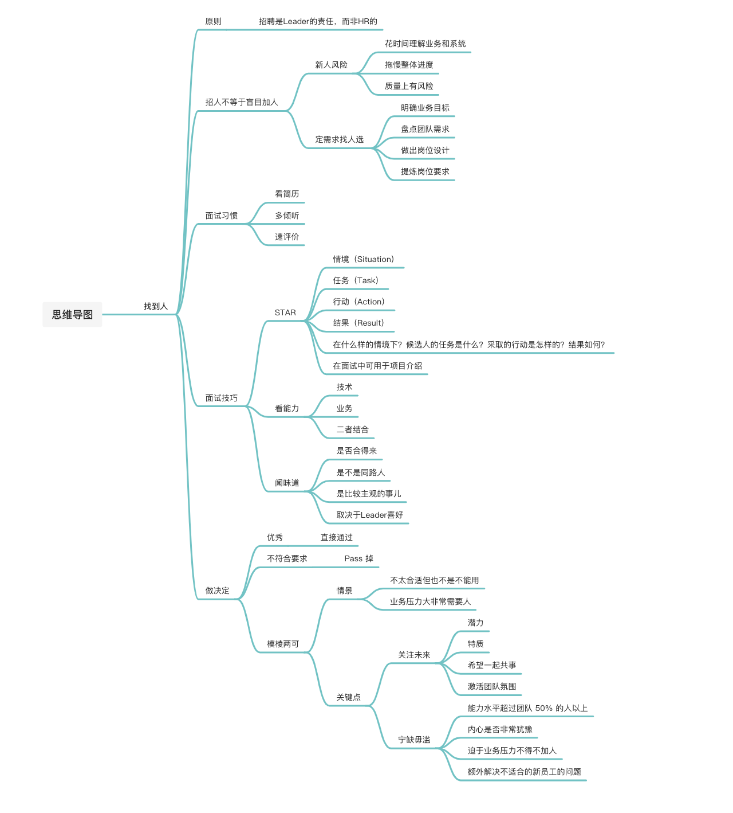
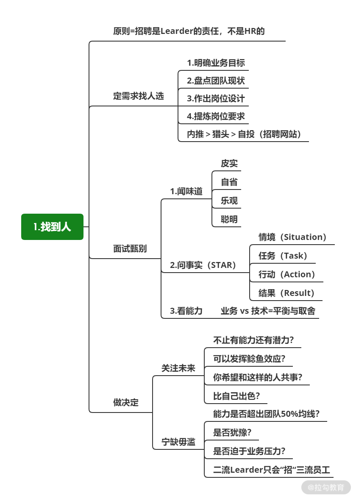

# 找到人：招聘是 Leader 的责任，不是 HR 的

## 简介 

招聘与解聘中有三个动作

1. 找到人

2. 能落地

3. 升级汰换

Leader主动出击寻找合适人选分析

* 最了解团队现状

* 对你个人影响最大

* 进人和离人的直接决策者

## 招人不等于盲目加人 

高耦合，低内聚想加入也不能发挥效果

* **时间上赶不及：**新加入的成员需要花费大量时间理解业务和系统，并不是人员到位之后就会立刻发挥作用，这个周期可能是几天也可能是一两周

* **拖慢整体进度：**新成员加入势必要老人花费时间与精力帮助他们熟悉系统，老人反而增加了任务，影响整体进度

* **质量上有风险：**新加入的成员在短时间了解业务和系统基本情况后，为了赶进度就会尽快上手，但是因为系统复杂度很高，会有更大概率交付Bug，后期要么是风险增加，要么为了覆盖这些风险要额外多做很多事，最终看进展可能和不加人时所差无几

不要无目的、无脑、下意识地加人

加对的人

* 明确业务目标；

* 盘点团队需求；

* 做出岗位设计；

* 提炼岗位要求。

例子

假如我负责订单系统年底业务上的目标是订单量实现翻倍，而业务上为了达到翻倍的目标会开拓很多新业务，比如增加商品的种类、丰富营销的玩法，那么这些新业务就会对系统有新的业务需求，同时也会对系统稳定性有要求。

**解决**

此时你就需要有过相关经验的同学，专门解决数据存储、性能、高并发等痛点问题，此时你就可以**根据业务目标和梳理出的团队现状做出岗位设计，然后再与 HR一起形成岗位 JD。**

招聘的渠道

* 内推

* 猎头

* 招聘网站

## 闻味道、问事实、看能力 

“面试习惯”与“面试技巧”二者缺一不可

面试习惯

* **面试前看简历：**在面试开始前花 10 分钟“细看简历”，思考其中你感兴趣的内容，结合岗位的需要，简单设计下面试题

* **面试中更多倾听：**不管是处于目的性还是基本的尊重，不要随意打断候选人的发言和思路，学会倾听 > 不断提问，只有他说的多你才能考察到更多

* **面试后速写评价：**当第二天 HR 问我的面试评价时，当时的感受已经忘得差不多了，所以你在面试完候选人时，要立刻记录下面试评价（这时，你的主观意识会更强，感受更强烈），同时也加快面试反馈的时间

面试技巧

* 问事实

  * 即STAR：情境（Situation）、任务（Task）、行动（Action）、结果（Result）

  * 也就是：在什么样的情境下？候选人的任务是什么？采取的行动是怎样的？结果如何？

  * **比如：**

    * 候选人“在某个项目中，我做了高并发的设计。”

    * 面试官“什么样高并发的设计，是什么场景？”

    * 候选人“在XX场景下，有短时间超过1K QPS的请求，我通过缓存和消息队列来处理。”

    * 我“缓存或者消息队列如果出故障了怎么办？会将系统整体拖垮吗？”

    * 候选人“缓存出故障了可能会，消息队列没关系，业务上能接受一定延迟，系统整体应该不会垮”

    * 面试官“缓存出问题了，数据库不会被击穿吗？为什么整体不会垮？”

    * 候选人“有并发限制，数据库可能会 Hang 住，这个场景与其他场景是隔离的，整体系统不会一起雪崩。”

    * 面试官“缓存在这里变成了强依赖，这样实现的好坏和解决方案你是怎么考虑的？”

**看候选人所说的内容他是否真正做过，以及他的思考过程。**

* 看能力

  * 技术能力（比如编程语言）

  * 业务能力（比如候选人做过电商，那就看他对电商领域的理解深度与广度）

  * 把看能力与问事实相结合
    * 比如“你之前做个那个XX系统，如果用户量增加 10 倍会有什么问题，怎么解决，如果增加 100 倍呢？”

* 闻味道

  * 不管是饿了么还是阿里，经常说“面试候选人一定要闻闻他的味道”

  * 候选人与你、与你们团队是否合得来，你们是不是同路人，是否可以一起共事

  * 会不会为团队发展一起努力？

  * 如果味道不同，很可能对团队造成不好的影响，拿不到好的结果

    * 比如：有些候选人不管你问什么都会先反驳下你说的可能，那么有可能你会觉得他比较傲或者沟通困难，但是在他看来自己并没有什么问题

    * 闻味道是一个比较主观的事儿，和找女朋友类似，并不存在客观标准

  * 对不同的 Leader 来说，倾向的味道也会不同

## 宁缺毋滥，守住底线 

综合候选人的表现，做出决定（是否发放 Offer 以及发怎样的 Offer）

* 候选人足够优秀，你可以不用考虑直接通过

* 候选人明显不符合要求，你也很容易 Pass 掉

* 但大多数情况下，你遇到的总是模棱两可的情景

  * 候选人不太合适但是也不是不能用

  * 业务压力大非常需要人

两个关键点：

* 关注未来

  * 他是否有能力的同时还有潜力？比如很强的发展欲望或学习能力？

  * 他身上是否有特质足够吸引你？比如让你觉得当他未来会比你更优秀？

  * 你是希望与他这样的人一起共事的？

  * 当他加入团队后，能否将团队氛围激活，形成鲶鱼效应？

* 宁缺毋滥

  * 能力水平超过团队 50% 的人以上：确保团队越来越强，而不是越来越弱。**有的 Leader会觉得候选人比团队最差的两个人好就可以了，但这样一来，随着时间拉长，你的团队会越来越差**

  * 内心是否非常犹豫？

  * 如果是迫于业务压力不得不加人，我建议你还是不要勉强

  * 可能要额外解决不适合的新员工的问题

**例子**

假设你现在需要为团队招聘一个技术专家，解决下半年业务发展中高并发、高可用的技术问题，现在有几个候选人，你会把 offer 给谁？

* 张三： 加入公司意愿很强烈，人很踏实，虽然技术深度不够（受限于过往经历），但是跟业务匹配度很高，来了就能上手干活发挥作用。

* 李四： 技术过硬，面试时也一直在追求技术的深度，人也比较踏实，但在沟通中他表示希望做的内容有足够高的技术挑战，而你团队现阶段的业务对他来说没有太大的技术难度。

* 王五： 在技术和业务上契合团队现状，但在沟通中你发现，他过于自信，不够自谦。

* 陈六： 跟业务很匹配，也很有冲劲，离职原因在于公司架构调整，认为在原公司缺少发展空间。

* 孙七： 以寻找机会为主，货比三家。

**分析**

* 我会把 offer 发给李四，技术挑战是一个追求，可以与团队现状动态平衡 

* 张三只解决现状，没有未来

* 王五 不符合自谦的味道，太过自信不仅未来成长容易受限，团队协作也可能有问题

* 陈六很常规，如果没有李四，陈六也可以考虑，但陈六存在一个问题：因为公司组织架构调整而离开，那他能否适应新公司的组织结构调整？

* 孙七很明显不用考虑，因为如果孙七 单纯货比三家的话，你很难在团队未来发展上与其达成共识

## 总结 

对 Leader 而言

* 比找人还重要的事非常少

* 缺人不会立刻死

* 但是找错人会让你和团队万劫不复

* 一个不正确的人对团队的杀伤力要远大于因为缺人大家要多加班造成的影响

* 不是要“招”更多的人

* 而是人海中“找”到对的人

* 足够出色的同学，对团队和未来的影响是一般同学的 10 倍甚至 100 倍

* 有追求和没追求的人在同一件事上会交付两个完全不同的答案

**和找伴侣有点儿类似，未必是最有钱、最优秀的那个，但一定是最适合、最舒服的那个**

