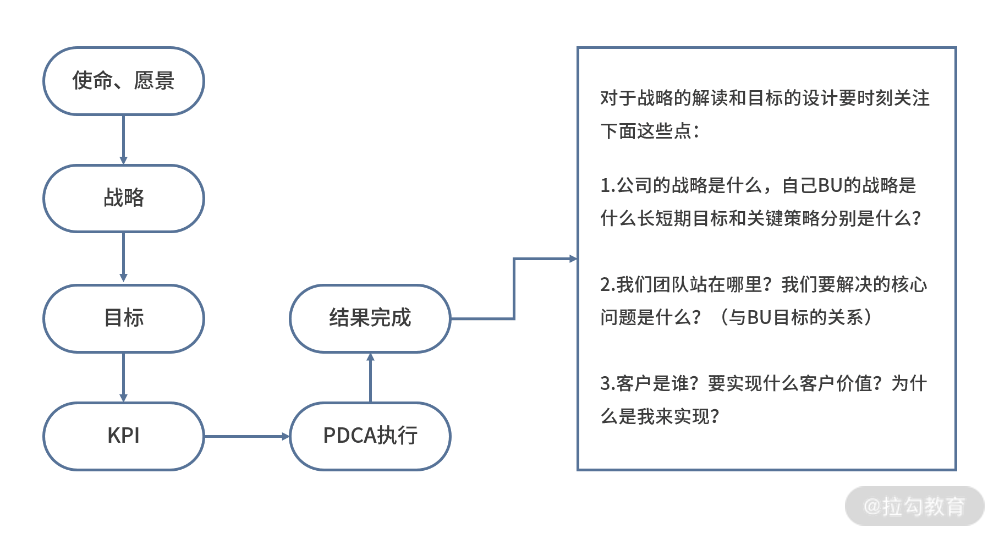

# 让你的方向与公司的方向保持一致

## 简介

拿结果三个动作

* 定目标

* 追过程

* 奖优罚劣

角色转变

* 因为技术扎实、为人友善、熟悉系统与业务等原因成为团队 Leader，但是角色转变后，被各种会议搞得焦头烂额，能力不但没得到提升，也没有得到老板的肯定

* 角色转变后，从解决自己的问题变为要解决团队的问题，要解决的问题也由单点变成多点，你很容易抓不住核心点

* 我们工作的过程就是一个不停拿结果的过程，首先你得有一个明确的目标作为参考，知道自己要拿什么结果、什么是好的结果，最终的交付与开始的目标间差值越小，结果才会越好

定目标三个关键点

1. 怎么解读目标

2. 制定目标、传递目标

3. 自上而下确定目标，自下而上完成目标

## 怎么解读目标？

确保自己做的事儿和公司的方向一致，顺势而为，没有走偏（公司的战略和目标）

解读流程

1. 阿里会将使命、愿景、价值观作为内核驱动

2. 结合目前的公司状况形成战略

3 . BU、部门根据战略拆解自己的组织目标

4. 然后目标逐级拆解并下发

5. 最终形成各部门可衡量的 KPI

一个上下同欲、力出一孔的过程如下

**目标不是一句口号，它是一个个层层拆解、递进的过程**

**解读目标是把公司的方向变成你的方向，把上一层的问题转变成你可以改变的问题**

**目标逐层分解的四个特性**

1. 你的主管，确定你老板的目标是什么

2. 你自身所在的团队、团队的成员们，根据团队情况确定现状

3. 与你紧密合作的上下游（研发）

4. 直接对口的业务与产品

## 怎么制定目标？

**核心：把你的方向变成团队、成员的目标**

**错误的制定：**去年怎么定，今年就在这个基础上预估一个可以实现的目标来制定目标

分析：如果以目前制定的目标为导向，对组织发展贡献的力量就很有限了

**设定目标更4 个关键点**

1. “短长”结合：长短期目标是有关联的，达成短期目标是为了长期规划做铺垫

2. 要足够聚焦：关键目标不要超过 3 个，最多控制在 5 个以内，要找最有客户价值、对公司战略最有帮助的点

3. 要有足够的挑战：这个度量是很考验你的

4. 要让组织有沉淀、个人有成长：制定目标的过程，也是一个让成员不断打磨自己的过程

**定策略、拆任务、细到人：**围绕目标和团队一起讨论策略与打法，将目标拆解成几个关键任务，明确到责任人

## 怎么传递目标？

**核心：**让员工把你的方向和目标变成自己的目标，最终走到同一个终点

常见的目标传递过程

传递过程中的问题

* 信息不对等

* 传递过程中的损失

* 个人理解的差异

错误的方式

* 发全员邮件

* 组织全员大会

* Review 大家的 KPI 

​		○ 有距离感

​		○ 不利于情感传递

​		○ 没有营造出轻松反馈

​		○ 没有讲清楚目标是怎么来

正确的传递目标的方式

1. 硬传递和软传递相结合

​		a. 有一个公开的场合让全员先知道有这么一回事

​		b. 在团建里策划

​			ⅰ. 我们团队的目标是什么

​			ⅱ. 这个目标是怎么来的

​			ⅲ. 即将面临的困难又是什么

2. 注意场合和时机

**目标要反复讲，要经常对焦**

## 总结

方向与目标：你要往哪去，你要走多远，你要走到哪

* 解读目标非常重要，切勿陷入极端，要么不解读，要么领导说什么就是什么

* 制定目标一定要够聚焦，但切勿只考虑眼前，注意“长短结合”

* 注意目标传递，要充分考虑团队成员的感受，选取合适的方式

目标的制定只是拿结果的起点 => 拿结果也只是整个团队里的一部分 => 管理是一套逻辑框架

每一部分都不是孤立存在而是彼此关联的，思想与动作需要具备连贯性以形成完整的管理闭环，所以我希望你也能秉持这样的理念去学习接下来的内容。

