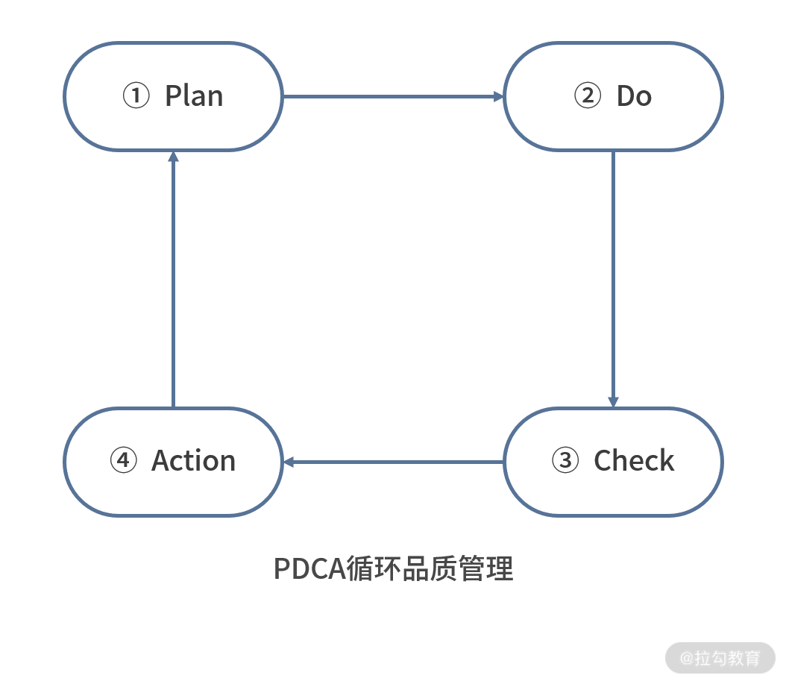
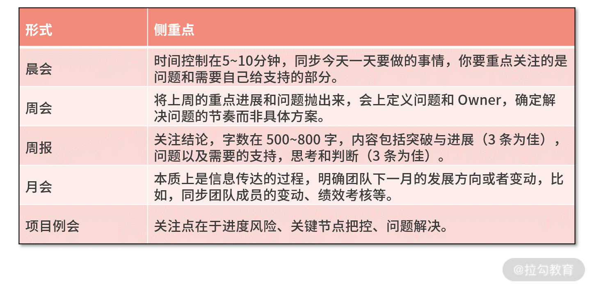
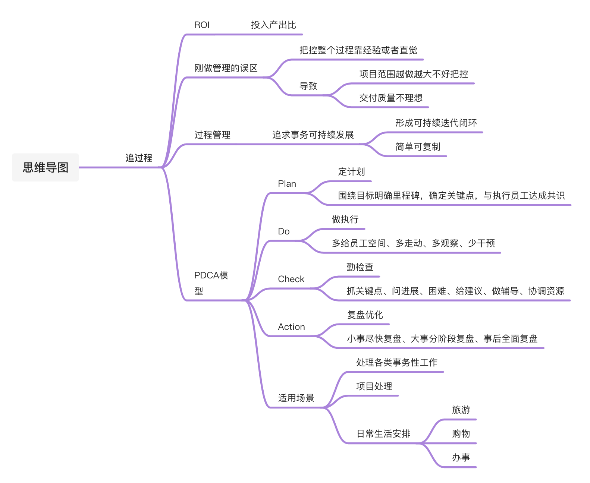

# 追过程：如何用 PDCA 做过程管理？

> 💡 Tips：ROI：即投入产出比（衡量工作效率），投资回报率，投入多少钱，收回多少钱，它们之间的比值，100元，卖出400元，ROI=400/100=4 

## 简介 

不少的技术 Leader刚开始做管理时，靠经验或者直觉去把控整个过程

项目规模较大时，结果就未必可控

* 范围越做越大

* 交付质量不理想

## 什么是过程管理？

**管理就是追求事务的可持续发展**

* 管理动作形成可持续迭代的闭环

* 管理动作足够简单到可以复制和个性化升级

**它的本质就是希望结果越来越好，让你原本靠运气或者模糊经验得来的成功可以被复制，让你在项目中灵光一闪的 Idea 变成你的常规能力**

渐渐地“套路化”，

## PDCA 模型

而 PDCA 模型就胜在简单、实用，还能让我根据自己的习惯和积累不断优化

* Plan（定计划）：围绕着目标明确里程碑，确定关键节点，与执行的员工达成共识。

* Do（做执行）：多给员工空间、多走动、多观察、少干预，放手而非放任，你也不能置身事外。

* Check（勤检查）：狠抓关键节点做检查、问进展、问困难、给建议、做辅导、协调资源。

* Action（复盘调优）：小事尽快复盘、大事分阶段复盘、事后全面复盘，抓住每一次提升和优化的机会。

## 如何用 PDCA 做过程管理？ 

### 案例还原

李明亮是一家教育公司研发中心的技术总监，前两天，公司启动了 S 级的大促项目，李明亮的团队接了其中 3 个子项目：A、B、C，那么他要怎么分配自己的时间、精力、抓住重点把控过程呢？**这是第一个问题**。

子项目 A （对交易系统进行改造）最复杂，风险也最高，需要对旧的核心系统做大量的改造，可旧的核心系统已经运行了好几年，负责人也迭代了好几次，这次要让谁负责呢？是团队目前能力最强的小王，还是对旧系统比较熟悉的老张？为了保证顺利交付，他想从方案设计、资源协调、落地执行、上线安排全程的深度参与，不知道是否合适，这是他遇到的**第二个问题**。

子项目 B（增加对新营销玩法的支持） 难度适中，李明亮交给了刚进入部门的小宇，小宇主观意识非常强，给出了很多的方案，一直希望李明亮放手让自己去试，李明亮犹豫了。这是他遇到的**第三个问题**。

子项目 C （根据压测瓶颈联合多团队进行系统调优）难度低，但是琐碎，涉及外部团队，老马虽然沉稳，但是沟通能力差，李明亮不知道是否让他担任这个工作，遇到了**第四个难题**。

他计划在确定人选之后，每周五与各个项目负责人 OneOne 项目进展，每两周三个项目一起做整体进展的对焦和复盘，但因为日常也在了解情况，目前节奏很紧张，例会该取消吗？这是他遇到的**最后一个问题**。

### 思路分析

目标的制定要“定策略、拆任务、细到人”

**那么在前两个问题中，**李明亮应该重点抓 D （执行）和 C （检查）：多给空间勤观察、狠抓节点做辅导。因为公司级项目目标比较清晰，重点在执行过程的把控上，并且因为几个项目同步进行，李明亮要保证的是三个项目的结果，自然无法完全 ALL IN 到某一个项目中。

所以，他一方面要放手给员工完成 Plan 的时间和空间，根据项目需要来确定会议的频次，确保信息及时且充分地对焦。另一方面要按照约定检查节点、对不同的项目和员工，要采取不同的方式。

子项目 A 既然难度最大，改造也是面向新系统和未来发展考虑，所以如果我是李明亮的话，会选择能力最强的小王来主导，最熟悉的老张为辅助，然后再结合最初定义好的关键节点，适当放手。

因为计划实施的主角是员工，过度干预会让员工束手束脚，所以给负责具体任务的同学足够的时间和空间，Leader 少干预，日常以观察和帮助为主。**在这里，比较重要的一点就是在于你怎么拿捏干预的度，这其实是你管理动作的核心，**我建议你在项目关键节点（P）的基础上关注团队伙伴的动态，比如项目进展中遇到的问题、团队成员的工作状态等。

很多能力和经验是历练出来的，只要过程可控，过程中走一些弯路也未必是坏事，要允许犯错。**但是你要注意，放手不等于放任，更不等于不闻不问，你依然要对最终的结果负责。**

**针对第三个问题**，既然子项目 B 的小宇能力稍弱，李明亮就应该多关注细节，了解进展，给予帮助，放手是对结果的不负责。你要在 Check 的环节多下功夫，才能确保项目和目标的一致与达成，一定要定期、多维度、较真地 Check！（比如，可以借助会议和邮件做好关键节点的把控与对焦，同时也将信息最大程度打通，那怎么用好它们就比较关键了。）

Check 时也会走进一些误区

1. 到了里程碑和关键点时间才进去 Check，日常对进展不关注、不跟进

2. 把追杀结果当作追过程，与员工不讲 Why，不讲方法，这是“管理者”的常见病。团队 Leader 要清楚，成员需要的是你的帮助和支持，而不是简单的情绪发泄；

3. 关键动作不够连续连贯，做出决策或者给出解决办法之后就默认问题已经解决，后续缺少跟进。

**第四个问题**比较容易解决。阿里有一句土话，叫“借事修人，借人成事”。项目 C 的难度和风险小就意味着更加可控，老马比较合适，针对沟通的问题，你可以驱动并帮助他在这个项目中得到锻炼，同时保持足够的关注确保整体进展与结果。

**最后一个问题**， 如果项目节奏紧张、你日常跟进也比较到位，那么可以取消周会。但是复盘会依然需要召开，因为前者的作用更多是信息同步对焦，它可以融入日常，而后者是将三个项目放在一起看整体，思考过程中的得失好坏，这是对团队和项目一个提炼沉淀的动作。

**而Action的核心在于建立循环，复盘优化**

* 复盘前：复盘前的核心在于思考复盘的目的和产出是什么

* 复盘中：自省是复盘会的基调，复盘就一个目的“找到团队的不足加以改进，以便在未来取得更好的结果”

* 复盘后：会议有结论，结论有计划，计划有责任人，责任人有行动，要建立机制保证在复盘会上讨论出的结论能够落地

* **小事儿尽快复盘，借此向团队成员传授自己的经验**

* **大事儿分阶段复盘，抓住重点矛盾**

## 总结

用 PDCA 模型模型处理各类事务性工作

* 一定要做好过程管理以取得可靠的结果

* 追哪些、什么时候追、追到什么程度才是你更应该关心的

* 复盘是 PDCA 管理动作中的闭环，每次都能提高一点点，长期积累的变化就很大

* PDCA适用于场景

​		○ 各种问题的思考框架

​		○ 项目处理

​		○ 日常生活安排（比如旅游、购物等）

